# منصّة خدمة النماذج اللغوية (LLM) الداخلية للشركة

> ⚠️ **تحديث الحالة ([ADR-025](docs/DECISIONS.md), 2026-06-26) — اقرأ أولاً:** هذه الوثيقة الأساسية كُتبت قبل التحوّل، وبعض تأطيرها قديم. الحقائق الحالية:
> - **المسار الأساسي = OWUI المدمج (RAG + Memory) كطبقة بيانات** — أي تأطير هنا يصنّف RAG/الذاكرة كـ"لاحقاً" **متجاوَز**؛ هما فعّالان اليوم.
> - **الستاك الحالي = 4 خدمات** (open-webui · litellm · llamacpp/Gemma 4 · postgres). محرّك سياق مخصّص + خدمة embeddings بُنيا ثم **تقاعدا إلى فرع `future/context-engine`**.
> - تضمين OWUI محلّي (all-MiniLM-384) **خارج البوّابة** — استثناء موثّق لمبدأ "كل شيء عبر البوّابة" (مُسجَّل في ADR-025).
> - **مصدر الحقيقة للحالة الجارية:** [docs/PROGRESS_MAP.md](docs/PROGRESS_MAP.md) و[docs/DECISIONS.md](docs/DECISIONS.md). اقرأ ما تحت كـ**رؤية/فلسفة معمارية** لا كوصف الحالة الفعلية.
>
> وثيقة معمارية حيّة: كيف نبني منصّة LLM داخلية تبدأ كـ "بذرة" self-hosted على لابتوب واحد، ومصمَّمة من اليوم الأول لتكبر إلى السحابة دون إعادة بناء — تحت مبدأ مركزي واحد: **توحيد كل شيء خلف واجهة OpenAI-compatible API + حاويات Docker + إعدادات خارجية**.
>
> **التاريخ:** 2026-06-24 · **الحالة:** مسوّدة أساس v1 (رؤية؛ انظر شارة ADR-025 أعلاه) · **الجمهور:** المهندس المنفّذ، القائد التقني، فريق مرحلة السحابة المستقبلي.

---

## 📖 كيف تقرأ هذه الوثيقة

هذه ليست خطوات تنفيذ فقط؛ هي **القرار + التبرير خلفه**. إن كنت تقرأ لأول مرة، اتبع المسار التالي:

- **عجلان؟** اقرأ [الملخّص التنفيذي](#01-summary) ثم [ملخّص القرارات الكبرى](#نظرة-سريعة-على-القرارات-الكبرى) أدناه.
- **منفّذ المرحلة الأولى؟** انتقل مباشرةً إلى [المبادئ](#02-principles) ← [المعمارية](#04-architecture) ← [Phase 1](#06-phases-phase1) ← [الملاحق](#10-appendix) (هياكل جاهزة).
- **صاحب قرار؟** ركّز على [الرؤية](#01-summary-vision)، [رحلة القرار](#03-decisions)، و[اقتصاديات Build vs Buy](#08-operations-build-vs-buy).
- **فريق السحابة لاحقاً؟** ابدأ من ["نفس الشكل، صناديق أكبر"](#04-architecture-same-shape) ثم [التطوّر المستقبلي](#09-future).

> 💡 المبدأ الذي يتكرّر عبر كل صفحة: **"نفس الشكل، صناديق أكبر"** — العقد ثابت (OpenAI API)، والتوسّع هو تكبير الصناديق خلفه، لا إعادة بناء.

### 🔑 مفتاح الرموز (Legend)

| الرمز | المعنى |
|---|---|
| > ✅ | قاعدة مُعتمدة / خلاصة مؤكَّدة — اعمل بها |
| > ⚠️ | تحذير أو مزلق شائع — انتبه قبل أن تخطو |
| > 💡 | بصيرة أو مبدأ موجِّه — السياق العميق خلف القرار |
| 🔭 | قرار **مُخطّط له، ليس الآن** — عمود محجوز في التصميم |
| 🔸 / "لاحقاً، ليس الآن" | خارج نطاق المرحلة الأولى عمداً (تجنّب الهندسة المفرطة) |

**استعارة ناطحة السحاب** (إطار ذهني موحّد عبر الوثيقة): التخطيط = التصميم المعماري · الأساس والأعمدة = المبادئ وواجهة API الموحّدة · الطوابق = الطبقات/المكوّنات · المصاعد والسباكة = الشبكة وتدفّق البيانات · مراحل البناء = مراحل التنفيذ · التشطيب والسكن = الإطلاق · الصيانة بعد السكن = المراقبة والتحسين.

---

## 🗂️ الفهرس الذكي

| # | القسم | المحتوى الأساسي |
|---|---|---|
| **1** | **[الملخّص التنفيذي والرؤية](#01-summary)** | الرؤية، معايير النجاح، النطاق |
| | ↳ [1.1 الرؤية والمشكلة والهدف](#01-summary-vision) · [1.2 ماذا يعني "النجاح"](#01-summary-success) · [1.3 النطاق](#01-summary-scope) · [1.4 الجمهور المستهدف](#01-summary-audience) · [1.5 خريطة استعارة ناطحة السحاب](#01-summary-metaphor) · [1.6 ماذا نبني، ولماذا الآن](#01-summary-what-why-now) | |
| **2** | **[الفلسفة والمبادئ التوجيهية](#02-principles)** | الأعمدة التسعة الحاملة |
| | ↳ [2.1 API-first](#02-principles-api-first) · [2.2 Portability](#02-principles-portability) · [2.3 Config-driven / 12-Factor](#02-principles-config-driven) · [2.4 Reversibility](#02-principles-reversibility) · [2.5 Security-by-design](#02-principles-security) · [2.6 Vendor-neutrality](#02-principles-vendor-neutrality) · [2.7 YAGNI](#02-principles-yagni) · [2.8 Observability](#02-principles-observability) · [2.9 الفصل بين الطبقات](#02-principles-separation) | |
| **3** | **[رحلة القرار والبدائل المرفوضة](#03-decisions)** | كيف وصلنا هنا، وماذا رفضنا ولماذا |
| | ↳ [3.1 الرحلة الفعلية](#03-decisions-journey) · [3.2 سجل القرارات (ADR Log)](#03-decisions-adr-log) · [3.3 بدائل مرفوضة](#03-decisions-rejected) | |
| **4** | **[المعمارية المستهدفة](#04-architecture)** | الطبقات الأربع والعقد الموحّد |
| | ↳ [4.1 المعمارية الطبقية](#04-architecture-layers) · [4.2 مخطّط المكوّنات](#04-architecture-component-diagram) · [4.3 "نفس الشكل، صناديق أكبر"](#04-architecture-same-shape) · [4.4 عقد الواجهات](#04-architecture-api-contract) · [4.5 خريطة المنافذ والشبكة](#04-architecture-ports-network) · [4.6 دورة حياة الطلب](#04-architecture-request-lifecycle) | |
| **5** | **[تفصيل المكوّنات](#05-components)** | المحرّك، البوّابة، الواجهة، التخزين، الإعدادات |
| | ↳ [5.1 محرّك الاستدلال](#05-components-engine) · [5.2 البوّابة (LiteLLM)](#05-components-gateway) · [5.3 الواجهة (Open WebUI)](#05-components-frontend) · [5.4 تخزين الموديلات](#05-components-storage) · [5.5 الإعدادات والأسرار](#05-components-config) | |
| **6** | **[مراحل التنفيذ (مراحل البناء)](#06-phases)** | خارطة البناء طابقاً بعد طابق |
| | ↳ [6.0 نظرة عامة](#06-phases-overview) · [6.1 Phase 0 — البروتوتايب](#06-phases-phase0) · [6.2 Phase 1 — البذرة](#06-phases-phase1) · [6.3 Phase 2 — Pilot سحابي](#06-phases-phase2) · [6.4 Phase 3 — التوسّع والتقوية](#06-phases-phase3) | |
| **7** | **[الأمان والحوكمة](#07-security)** | الضوابط المتدرّجة حول البوّابة |
| | ↳ [7.1 المصادقة والصلاحيات](#07-security-authn-authz) · [7.2 المفاتيح الافتراضية ودورانها](#07-security-keys) · [7.3 إدارة الأسرار](#07-security-secrets) · [7.4 سياسة التسجيل والـ PII](#07-security-logging-pii) · [7.5 عزل الشبكة](#07-security-network) · [7.6 حوكمة تراخيص الموديلات](#07-security-licenses) · [7.7 سجلّ التدقيق](#07-security-audit) · [7.8 جدول المرجع: الضابط × المرحلة](#07-security-summary) | |
| **8** | **[التشغيل والمراقبة والتكلفة](#08-operations)** | الصيانة بعد السكن |
| | ↳ [8.1 المراقبة](#08-operations-observability) · [8.2 فحوص الصحة](#08-operations-health) · [8.3 النسخ الاحتياطي](#08-operations-backup) · [8.4 Runbooks](#08-operations-runbooks) · [8.5 تخطيط السعة](#08-operations-capacity) · [8.6 نموذج التكلفة](#08-operations-cost) · [8.7 اقتصاديات Build vs Buy](#08-operations-build-vs-buy) · [8.8 الأدوات المقترحة](#08-operations-tooling) | |
| **9** | **[التطوّر المستقبلي والشكل النهائي والمخاطر](#09-future)** | الطوابق العليا وسجلّ المخاطر |
| | ↳ [9.1 خارطة التطوّر بعد Phase 3](#09-future-roadmap) · [9.2 الشكل النهائي للنظام](#09-future-final-shape) · [9.3 جدول المخاطر والتخفيف](#09-future-risks) · [9.4 مؤشّرات النجاح (KPIs)](#09-future-kpis) | |
| **10** | **[الملاحق والمراجع](#10-appendix)** | هياكل إشارية وقوائم تحقّق |
| | ↳ [10.1 قاموس المصطلحات](#10-appendix-glossary) · [10.2 هيكل docker-compose](#10-appendix-compose) · [10.3 هيكل إعداد LiteLLM](#10-appendix-litellm) · [10.4 متغيّرات البيئة](#10-appendix-env) · [10.5 قائمة Quick Start](#10-appendix-quickstart) · [10.6 فهرس سجل القرارات](#10-appendix-decisions-index) · [10.7 روابط مراجع](#10-appendix-references) | |

---

## نظرة سريعة على القرارات الكبرى

ملخّص للقرارات المعمارية الحاكمة. التفاصيل الكاملة وبدائلها المرفوضة في [القسم 3: رحلة القرار](#03-decisions).

| القرار | الاختيار | لماذا (مختصر) | الحالة |
|---|---|---|---|
| **عقد القابلية للنقل** | [واجهة OpenAI-compatible API](#03-decisions-adr-log) | عقد ثابت يفصل العميل عن المحرّك؛ التبديل = تغيير `base_url` فقط | ✅ مُعتمد (المبدأ المركزي) |
| **محرّك الاستدلال المحلي** | [llama.cpp عبر `llama_cpp.server`](#03-decisions-rej-vllm-laptop) | الأكفأ/الأخف لموديلات GGUF على RTX 4050 (6GB)؛ vLLM لا تفيد مستخدماً واحداً | ✅ مُعتمد |
| **البوّابة المركزية** | [LiteLLM Proxy](#03-decisions-rej-no-gateway) | MIT، self-host مجاني، يوحّد المفاتيح/التوجيه/الحصص خلف `/v1` — عمود حامل لا قطعة اختيارية | ✅ مُعتمد |
| **الواجهة + التغليف** | [Open WebUI + Docker Compose](#03-decisions-rej-custom-ui) | واجهة ناضجة جاهزة (RBAC/SSO/RAG)؛ نفس الحاويات تنتقل للسحابة بلا إعادة بناء | ✅ مُعتمد |
| **محرّك السحابة + المزج** | [vLLM + موديلات مُدارة عبر البوّابة](#03-decisions-rej-managed-only) | continuous batching للتوسّع؛ المزج (hosted + managed) خلف نفس النقطة | 🔭 مُخطّط (ليس الآن) |

---

<a id="01-summary"></a>

## 1. الملخّص التنفيذي والرؤية

> 💡 **في جملة واحدة:** نبني منصّة خدمة نماذج لغوية (LLM) داخلية للشركة، تبدأ اليوم كـ "بذرة" self-hosted بسيطة على لابتوب واحد، ومصمَّمة منذ السطر الأول لتكبر إلى السحابة دون إعادة بناء — عبر مبدأ مركزي واحد: **توحيد كل شيء خلف واجهة OpenAI-compatible API + حاويات Docker + إعدادات خارجية (config-driven)**.

<a id="01-summary-vision"></a>

### 1.1 الرؤية والمشكلة والهدف

نحن لا نبني "تطبيق دردشة" ولا "تجربة موديل على لابتوب". نحن نضع **أساس منصّة** (platform) ستخدم الشركة لسنوات. هذا الفرق جوهري في كل قرار نتخذه لاحقاً.

**المشكلة** التي نحلّها ذات طبقتين:

1. **الحاجة الآنية:** فريق صغير (1–10 مستخدمين) يحتاج وصولاً موحّداً وآمناً لنماذج لغوية للتطوير والتجريب، بدل أن يستخدم كل شخص أدوات متفرّقة ومفاتيح خام موزّعة بلا حوكمة.
2. **الحاجة المستقبلية:** عندما تنمو الشركة، يجب أن تتوسّع المنصّة إلى السحابة (AWS/Azure/GCP) لخدمة مئات المستخدمين والتطبيقات الداخلية — **دون** أن نضطر لرمي ما بنيناه والبدء من الصفر.

**الهدف المعماري الذهبي** (المرجع الذي يحكم كل ما يليه):

> ✅ يُبنى النظام بحيث يمكن **التبديل** (engine swap) و**التوسّع** (scale-out) و**المزج** (hybrid: موديل مستضاف + موديل مُدار) في أي لحظة، وأن يكون أكبر تغيير مطلوب للانتقال للسحابة هو **تغيير عنوان URL واحد وتشغيل نفس الحاويات على GPU سحابي** — لا إعادة كتابة كود العملاء، ولا تغيير واجهة المستخدم.

السرّ في تحقيق هذا ليس أداة سحرية، بل **انضباط معماري**: العملاء (التطبيقات، السكربتات، الموظفون) لا يرون أبداً محرّك الاستدلال مباشرةً — يرون فقط بوّابة موحّدة تتكلم لغة OpenAI API. ما خلف البوّابة (llama.cpp على اللابتوب اليوم، vLLM على GPU سحابي غداً، أو Bedrock/Azure OpenAI مُدار) يصبح **تفصيلاً قابلاً للاستبدال**، لا قراراً مصيرياً.

<a id="01-summary-success"></a>

### 1.2 ماذا يعني "النجاح"

النجاح هنا **ليس** "الموديل يردّ على سؤال". هذا أنجزناه فعلاً في الرحلة السابقة (شغّلنا Qwen3 وGemma على الـ GPU عبر llama.cpp). النجاح الآن **معماري وتشغيلي**:

| معيار النجاح | المرحلة الأولى (الآن) | الدليل القاطع على تحققه |
|---|---|---|
| **قابلية التبديل** (Swappability) | محرّك واحد خلف البوّابة | تبديل المحرّك = تعديل URL واحد في إعداد البوّابة، بلا لمس أي عميل |
| **التوحيد** (Unification) | كل الوصول عبر بوّابة LiteLLM | لا أحد يستخدم مفتاح مزوّد خام؛ كل طلب يمرّ بمفتاح افتراضي (virtual key) |
| **البساطة** (Simplicity) | `docker compose up` يشغّل كل شيء | موظّف جديد يُشغّل المنصّة محلياً خلال دقائق، بلا خطوات يدوية معقّدة |
| **قابلية التوسّع المستقبلية** (Future scalability) | نفس الصور (images) جاهزة للسحابة | نفس `docker-compose` ونفس عقد الـ API ينتقلان لـ Kubernetes دون تعديل العملاء |
| **الحوكمة** (Governance) | مفاتيح + حصص + تسجيل مركزي | كل طلب قابل للعزو (attribution) لمستخدم/فريق، مع سقف إنفاق |

> ⚠️ **معيار فشل صريح يجب تجنّبه:** أن ننزلق إلى "حُفرة الـ pilot" (pilot purgatory) — حيث ~95% من تجارب GenAI المؤسسية لا تُنتج أثراً قابلاً للقياس، و~30% تُهجَر بعد الـ POC. سبب الفشل غالباً **هيكلي/تشغيلي** (معايير نجاح ضعيفة، لا مسار للتوسّع)، لا جودة الموديل. لذلك نحدّد معايير النجاح أعلاه **قبل** البناء، ونحرص ألا يكون النظام عاجزاً عن النمو بنيوياً.

<a id="01-summary-scope"></a>

### 1.3 النطاق (داخل وخارج الـ Scope)

تحديد النطاق بوضوح هو ما يحمينا من **الهندسة المفرطة** (over-engineering) — وهي نمط فشل مُسمّى: إدخال بوّابة ثقيلة متعددة الميزات لاستخدام بسيط يضيف تعقيداً بلا عائد ("مطرقة لكسر بندقة").

**داخل النطاق — المرحلة الأولى (الآن):**

- ✅ بوّابة **LiteLLM** كنقطة وصول موحّدة (OpenAI-compatible) على المنفذ الداخلي.
- ✅ محرّك استدلال محلي: **llama.cpp** عبر `llama_cpp.server` يخدم موديلات GGUF على الـ RTX 4050.
- ✅ واجهة **Open WebUI** للموظفين، خلف البوّابة.
- ✅ كل شيء داخل **Docker Compose** مع إعدادات خارجية (`config.yaml` + `.env`).
- ✅ أساس الحوكمة: مفاتيح افتراضية، سقوف إنفاق مبدئية، تسجيل مركزي.

**خارج النطاق — صراحةً "لاحقاً، ليس الآن":**

- 🔸 **Kubernetes / Karpenter / KEDA / autoscaling** — لاحقاً، عند الانتقال للسحابة.
- 🔸 **vLLM / SGLang** كمحرّك إنتاج — لاحقاً؛ مبرّرها (continuous batching للـ throughput تحت تزاحم عالٍ) لا يفيد مستخدماً واحداً اليوم.
- 🔸 **SSO/OIDC، RBAC متقدّم، PII redaction، audit مؤسسي** — لاحقاً؛ نترك "خطّافات" (hooks) لها دون تفعيلها.
- 🔸 **Terraform، External Secrets Operator، MIG/time-slicing** — لاحقاً، طبقة البنية التحتية السحابية.
- 🔸 **HA متعدد النسخ، Redis لمزامنة الحصص، PostgreSQL للحالة** — لاحقاً؛ المرحلة الأولى تبقى single-node.

> 💡 المبدأ الحاكم: **ابدأ بسيطاً فعلاً، واترك المسار مفتوحاً.** كل بند "لاحقاً" أعلاه يجب أن يكون **قابلاً للإضافة دون إعادة بناء** — وهذا بالضبط ما يضمنه عقد الـ OpenAI API + الحاويات + الإعدادات الخارجية.

<a id="01-summary-audience"></a>

### 1.4 الجمهور المستهدف للوثيقة

| الجمهور | ما يأخذه من الوثيقة |
|---|---|
| **المطوّر/المهندس المنفّذ** (الأساسي) | كيف يبني المرحلة الأولى عملياً، ولماذا كل قرار اتُّخذ، وكيف لا يحبس نفسه معمارياً |
| **القائد التقني / صاحب القرار** | لماذا هذا المسار (self-host الآن، سحابة لاحقاً) منطقي اقتصادياً ومعمارياً |
| **الفريق المستقبلي** (من ينفّذ مرحلة السحابة) | المرجع الذي يشرح النوايا المعمارية ونقاط التوسّع المعلّمة سلفاً |

الوثيقة مكتوبة كـ **وثيقة هندسية حيّة**: تشرح القرار **والتبرير خلفه**، لا مجرد خطوات. الافتراض أن قارئها سيُسأل لاحقاً "لماذا فعلتم هذا؟" — والإجابة موجودة هنا.

<a id="01-summary-metaphor"></a>

### 1.5 خريطة استعارة ناطحة السحاب

نستخدم بناء ناطحة سحاب كإطار ذهني موحّد عبر الوثيقة. الفكرة الجوهرية: **مهندس ناطحة السحاب يصمّم الأساس والأعمدة من اليوم الأول لتحمل كل الطوابق المستقبلية — حتى لو بُني طابق واحد فقط الآن.** هذا هو بالضبط "الشرط الذهبي" لمنصّتنا.

| مفهوم في الاستعارة | ما يقابله في المعمارية | لماذا يهم |
|---|---|---|
| **التخطيط والتصميم المعماري** | اختيار المبادئ والمكوّنات قبل البناء | القرارات المعمارية الكبرى تُتّخذ مرة واحدة |
| **الأساس والأعمدة** | المبادئ + واجهة **OpenAI-compatible API** الموحّدة | العمود الحامل الذي يُبنى عليه كل شيء؛ لا يتغيّر عند التوسّع |
| **الطوابق** | الطبقات/المكوّنات: واجهة → بوّابة → محرّك → موديلات | كل طبقة مستقلّة وقابلة للاستبدال |
| **المصاعد والسباكة** | الشبكة، تدفّق البيانات، استدعاءات الـ API بين المكوّنات | المسارات التي تربط الطوابق؛ موحّدة منذ البداية |
| **مراحل البناء** | مراحل التنفيذ (المرحلة الأولى الآن → السحابة لاحقاً) | نبني طابقاً واحداً الآن، لكن على أساس يحمل ناطحة كاملة |
| **التشطيب والسكن** | الإطلاق وتشغيل المستخدمين الفعليين | جعل المنصّة جاهزة للاستخدام اليومي |
| **الصيانة بعد السكن** | المراقبة (observability) والتحسين المستمر | الحياة بعد الإطلاق: التكلفة، الأداء، الترقيات |

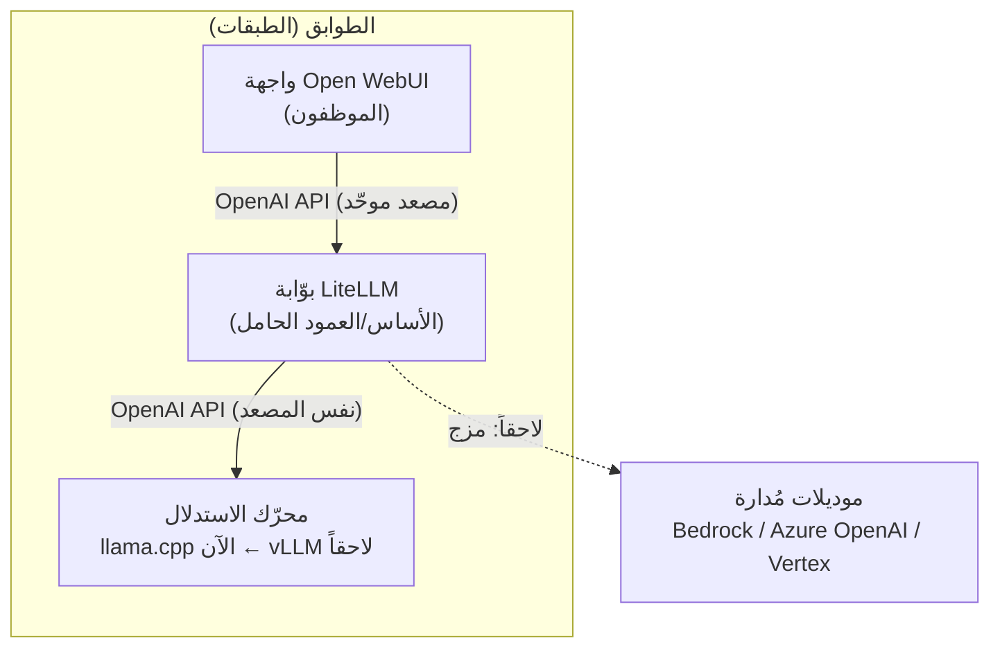

<a id="01-summary-what-why-now"></a>

### 1.6 ماذا نبني، ولماذا الآن

نبني **منصّة LLM داخلية بطبقتين**: بوّابة LiteLLM في المركز كنقطة وصول موحّدة (OpenAI-compatible) تتولّى المفاتيح والتوجيه والحصص والتسجيل، وأمامها واجهة Open WebUI للموظفين، وخلفها محرّك llama.cpp يخدم موديلات GGUF محلياً على الـ RTX 4050 — كل ذلك داخل Docker Compose بإعدادات خارجية. نفعل هذا **الآن** لأن البداية الصغيرة هي بالضبط اللحظة المثلى لتثبيت المبادئ المعمارية الصحيحة (عقد API موحّد، حاويات، فصل الإعدادات) بأقل تكلفة وأقل تعقيد؛ فاقتصاديات 2026 واضحة أن self-host لمستخدم واحد بسيط ورخيص للتطوير، بينما المنصّات المُدارة والـ GPU السحابي يصبحان المنطق الصحيح عند الحجم الكبير لاحقاً. وبما أننا نوحّد كل شيء خلف الـ OpenAI API منذ اليوم الأول، فإن الانتقال من "بذرة" اللابتوب إلى ناطحة سحاب الشركة يصبح سلسلة من **ترقيات الصناديق** — لا إعادة بناء. نفس الشكل، صناديق أكبر.

<a id="02-principles"></a>

## 2. الفلسفة والمبادئ التوجيهية

قبل أن نضع حجراً واحداً، نتّفق على القواعد التي تحكم كل قرار لاحق. في استعارة ناطحة السحاب، هذه المبادئ هي **الأساس والأعمدة الحاملة**: لا تراها العين بعد التشطيب، لكنها ما يسمح بإضافة طوابق فوقها لاحقاً دون هدم ما بُني. كل مبدأ هنا مُختار لخدمة هدف واحد فوق كل شيء: **أن نبدأ بسيطاً اليوم، وأن نتمكّن من التبديل والتوسّع في أي لحظة دون إعادة بناء**.

> 💡 المبادئ ليست شعارات. كل مبدأ أدناه يُترجَم إلى قرار ملموس في الإعداد (config) أو في البنية، ونُبيّن "كيف يظهر عملياً" حتى لا يبقى مجرّد كلام.

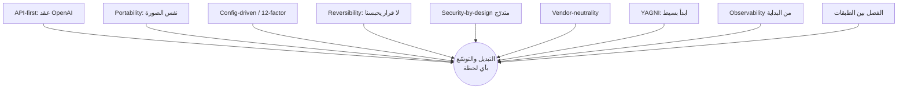

<a id="02-principles-api-first"></a>

### 2.1 المبدأ الأول: API-first — واجهة OpenAI كعقد ثابت

**المبدأ:** كل مكوّن في المنصّة يتخاطب عبر واجهة OpenAI-compatible API (تحديداً `/v1/chat/completions`، `/v1/completions`، `/v1/embeddings`، `/v1/models`). هذا العقد هو الثابت الوحيد الذي لا يتغيّر مهما تغيّر ما خلفه.

**لماذا:** الواجهة الموحّدة هي "عقد النقل" (portability contract) الذي يفصل العميل (frontend، تطبيق داخلي، agent، script) عن المحرّك الفعلي. ما دام العميل يكتب مقابل هذا العقد، فإن استبدال llama.cpp بـ vLLM، أو محرّك محلي بموديل مُدار (Bedrock/Azure OpenAI)، يصبح تغيير `base_url` لا إعادة كتابة كود.

**كيف يظهر عملياً:**
- كل client يُهيّأ بـ `base_url` و`api_key` قابلين للتغيير من الخارج، ولا يُكتب أي كود يعتمد على خصوصيات محرّك بعينه.
- محرّك الاستدلال يُشغَّل عبر `python -m llama_cpp.server` الذي يكشف `/v1` جاهزاً — نفس الشكل الذي ستكشفه vLLM لاحقاً بـ `vllm serve`.
- البوّابة (LiteLLM) تكشف هي الأخرى نقطة `/v1` واحدة، فيصبح كل ما تحت البوّابة قابلاً للاستبدال خلفها.

> ⚠️ العقد قابل للنقل في جوهره (chat/completions)، لكن الميزات المتقدّمة (تنسيقات tool/function-calling، structured output، logprobs، vision) تتفاوت بين المحرّكات. اختبر النقاط التي يعتمد عليها عميلك فعلياً **قبل** أي تبديل، ولا تفترض التكافؤ الكامل.

<a id="02-principles-portability"></a>

### 2.2 المبدأ الثاني: Portability — البساطة الآن، التوسّع لاحقاً، بنفس "الصورة"

**المبدأ:** المنصّة تُبنى مرّة واحدة كصورة حاوية (container image) واحدة وإعدادات خارجية، ثم تُرقّى كما هي من اللابتوب إلى السحابة. الشعار: **"نفس الشكل، صناديق أكبر"**.

**لماذا:** أكبر مصدر لإعادة البناء هو ربط الكود بالبيئة التي يعمل فيها. حين تكون نفس الصورة هي ما يعمل على اللابتوب وعلى Kubernetes في السحابة، فإن الانتقال يصبح "تشغيل نفس الحاويات على GPU أكبر"، لا مشروعاً جديداً.

**كيف يظهر عملياً:**
- صورة واحدة غير قابلة للتعديل (immutable) تُرقّى dev ← staging ← prod؛ لا نُعيد البناء لكل بيئة.
- على Kubernetes لاحقاً، نطلب الـ GPU بالمفتاح المحمول `nvidia.com/gpu` فيعمل نفس الـ manifest على EKS/AKS/GCP دون تغيير.
- الفرق بين "الآن" و"لاحقاً" يقتصر على حجم الصندوق (محرّك أخف/GPU أصغر الآن، vLLM/GPU أكبر لاحقاً) لا على شكل المنصّة.

> 💡 هذا المبدأ هو ما يجعل قرار "اللابتوب أولاً" قراراً استراتيجياً لا مؤقتاً: نحن نتعلّم الموديل التشغيلي على جهاز رخيص، ثم نكبّره دون أن نهدمه.

<a id="02-principles-config-driven"></a>

### 2.3 المبدأ الثالث: Config-driven & 12-Factor — الإعداد خارج الكود

**المبدأ:** كل ما يتغيّر بين البيئات — اسم الموديل، عنوان المحرّك، المفاتيح، حجم السياق، حدود الحصص — يأتي من متغيّرات بيئة (env vars) أو ملفات إعداد مُحمّلة (`config.yaml`، `.env`)، ولا يُكتب صلباً (hardcoded) أبداً في الكود أو الصورة.

**لماذا:** هذا هو الجانب العملي من Portability. الصورة الواحدة لا تكون قابلة للنقل فعلاً إلا إذا كانت "صمّاء" تجاه البيئة: تتلقّى كل ما تحتاجه من الخارج عند التشغيل. وفق منهج 12-factor، الإعداد منفصل تماماً عن الشيفرة.

**كيف يظهر عملياً:**
- ملف `litellm-config.yaml` يحدّد قائمة الموديلات والتوجيه؛ تبديل المحرّك = تعديل سطر `api_base` واحد فيه.
- `.env` يحمل الأسرار محلياً، ويُستبدل لاحقاً بمدير أسرار سحابي (External Secrets Operator فوق AWS Secrets Manager / Azure Key Vault / GCP Secret Manager) **دون تغيير الكود**.
- لا قيم خاصة بسحابة معيّنة (region، أسماء buckets، ARNs، أنواع instances) داخل الصورة أو الكود؛ مكانها متغيّرات التشغيل ومتغيّرات Terraform.

| ما الذي يتغيّر؟ | أين يُوضَع؟ | لماذا لا يُوضع في الكود؟ |
|---|---|---|
| عنوان المحرّك (`api_base`) | `litellm-config.yaml` | لنبدّل llama.cpp ↔ vLLM ↔ Bedrock بسطر |
| المفاتيح والأسرار | `.env` → secret manager | أمان + اختلاف البيئات |
| اسم الموديل / حجم السياق | env / config | يختلف بين اللابتوب والسحابة |
| الحصص والميزانيات | config البوّابة + DB | تتغيّر بالسياسة لا بالكود |

<a id="02-principles-reversibility"></a>

### 2.4 المبدأ الرابع: Reversibility — لا قرار يحبسنا (no lock-in)

**المبدأ:** نُفضّل القرارات القابلة للتراجع. أي خيار تقني يُتّخذ بحيث يمكن عكسه أو استبداله لاحقاً بكلفة محدودة، ونتجنّب القرارات أحادية الاتجاه ما لم تكن ضرورية ومدروسة.

**لماذا:** "الشرط الذهبي" للمستخدم هو القدرة على التبديل والتوسّع **في أي لحظة**. هذا لا يتحقّق إلا إذا كانت كل طبقة قابلة للاستبدال على حدة. الـ lock-in — سواء بمحرّك، أو مزوّد سحابي، أو حتى تنسيق بيانات — هو العدوّ المباشر لهذا الشرط.

**كيف يظهر عملياً:**
- العقد الموحّد (2.1) يجعل المحرّك قابلاً للعكس: نجرّب vLLM، وإن لم يناسب نعود للسابق بتغيير `api_base`.
- البوّابة في المنتصف تتيح **المزج**: موديل مستضاف ذاتياً + موديل مُدار خلف نفس النقطة، فلا نلتزم بمصدر واحد.
- نُفضّل المكوّنات المفتوحة (LiteLLM MIT، Open WebUI، llama.cpp/vLLM) لأنها تُبقي باب الخروج مفتوحاً، ونحدّ من الاعتماد على ميزات enterprise مغلقة في المرحلة الأولى.

> ⚠️ بعض القرارات لها كلفة عكس حقيقية: اختيار vector DB للـ RAG، أو ربط هوية المستخدمين بـ IdP معيّن. صنّف هذه صراحةً كـ "قرارات ثقيلة" وراجعها بعناية قبل الالتزام.

<a id="02-principles-security"></a>

### 2.5 المبدأ الخامس: Security-by-design متدرّج — أمان مبني لا مُلصق

**المبدأ:** الأمان جزء من التصميم منذ اليوم الأول، لكنه **متدرّج**: نطبّق الأساسيات الرخيصة فوراً، ونؤجّل الضوابط الثقيلة (SSO/RBAC كامل، PII redaction، audit متقدّم) إلى مراحلها وسمّاً صريحاً "لاحقاً، ليس الآن".

**لماذا:** إضافة الأمان لاحقاً كطبقة مُلصقة مكلفة وهشّة. لكن في المقابل، فرض ضوابط enterprise كاملة على 1–10 مستخدمين هو over-engineering. الحلّ: قاعدة آمنة من البداية تتحمّل البناء فوقها.

**كيف يظهر عملياً (الأساسيات الآن):**
- ✅ **منفذ البوّابة لا يُكشف للإنترنت أبداً**؛ Open WebUI فقط يصل إلى LiteLLM داخل شبكة Docker.
- ✅ مفتاح master قوي للبوّابة (`LITELLM_MASTER_KEY`) و`LITELLM_SALT_KEY` لتشفير بيانات اعتماد المزوّدين المخزّنة.
- ✅ مفاتيح افتراضية (virtual keys) لكل مستخدم/تطبيق بدل تمرير مفاتيح المزوّد الخام — فلا نفقد الإسناد ولا التتبّع.
- ✅ الأسرار في `.env`/secret manager لا في الكود، والتحديث الأمني سريع (CVE معروفة في LiteLLM تُعالَج بالترقية الفورية).

**لاحقاً، ليس الآن:** SSO عبر OIDC، RBAC على مستوى الموديل، PII redaction، audit logs مفصّلة، SCIM. البنية تستوعبها لأن البوّابة والواجهة مصمّمتان لها أصلاً.

> ⚠️ تجنّب فخّين شائعين: (1) **منفذ بوّابة مكشوف قبل المصادقة** = ثغرة RCE/SQLi مباشرة؛ (2) **تسجيل المحتوى الكامل** يحوّل سجلّاتك إلى بحيرة بيانات PII — سجّل metadata فقط في المرحلة الأولى.

<a id="02-principles-vendor-neutrality"></a>

### 2.6 المبدأ السادس: Vendor-neutrality — حياد المزوّد

**المبدأ:** لا نراهن على مزوّد سحابي واحد ولا على مزوّد موديل واحد. كل اعتماد على مزوّد يُعزَل خلف طبقة تجريد قياسية، بحيث يبقى استبداله ممكناً.

**لماذا:** المستقبل "غالباً سحابة" لكن **أيّ** سحابة لم يُحسم. الحياد يحفظ قدرتنا على المفاوضة على السعر، والاستفادة من توفّر الـ GPU حيثما وُجد، وتجنّب أن تصبح كلفة الخروج مانعاً استراتيجياً.

**كيف يظهر عملياً:**
- البوّابة (LiteLLM) تجرّد +100 مزوّد خلف واجهة واحدة، مع routing وfallbacks بين مزوّد أساسي واحتياطي.
- على البنية التحتية: نفس الـ manifest فوق `nvidia.com/gpu` يعمل على EKS/AKS/GKE؛ Terraform يُبنى بنمط "واجهة موحّدة + تنفيذ خاص بكل سحابة" فتُحصَر الفروق في المتغيّرات.
- الأسرار عبر External Secrets Operator: تبديل السحابة = تبديل الـ backend فقط، لا تغيير التطبيق.

<a id="02-principles-yagni"></a>

### 2.7 المبدأ السابع: ابدأ بسيط — YAGNI وتجنّب الهندسة المفرطة

**المبدأ:** لا نبني قدرة قبل أن نحتاجها فعلاً (You Aren't Gonna Need It). المرحلة الأولى يجب أن تبقى **بسيطة فعلاً**: أقل عدد ممكن من المكوّنات لتشغيل 1–10 مستخدمين.

**لماذا:** الهندسة المفرطة هي نمط فشل مُسمّى ("مطرقة لكسر جوزة"). البيانات صارخة: نحو 95% من تجارب GenAI المؤسسية لا تُحدث أثراً ملموساً، وقرابة 30% تُهجَر بعد POC — والسبب الغالب تشغيلي/بنيوي لا جودة الموديل. التعقيد المبكّر يستنزف الجهد دون عائد.

**كيف يظهر عملياً:**
- المرحلة الأولى = ثلاث حاويات فقط: Open WebUI ← LiteLLM ← المحرّك المحلي، عبر Docker Compose، مع Postgres لحالة البوّابة. *(الآن: 4 خدمات فعليّة — open-webui · litellm · llamacpp · postgres — [ADR-025](docs/DECISIONS.md).)*
- نؤجّل صراحةً: Kubernetes، autoscaling (KEDA/Karpenter)، Redis متعدّد النسخ، MIG، vLLM — كلها **"لاحقاً، ليس الآن"**.
- القاعدة: نُشغّل البسيط، نفهم القطع المتحرّكة، ثم نضيف الضوابط التي يفرضها واقعنا — لا التي يفرضها كتالوج الميزات.

> 💡 التوتّر بين "ابدأ بسيط" و"ابنِ للتوسّع" يُحلّ لا بإضافة تعقيد، بل بالالتزام بالعقد الموحّد (2.1) والإعداد الخارجي (2.3): هما يمنحان قابلية التوسّع **مجاناً** تقريباً دون بناء بنية ثقيلة الآن.

<a id="02-principles-observability"></a>

### 2.8 المبدأ الثامن: Observability من البداية — لا تطير بلا أدوات قياس

**المبدأ:** نُدخل حدّاً أدنى من الرصد منذ المرحلة الأولى: من يستهلك ماذا، وكم، وبأي كلفة. الرصد المتقدّم (Prometheus/Grafana/DCGM) يأتي لاحقاً، لكن الأساس موجود من اليوم الأول.

**لماذا:** بدون رصد، لا نعرف متى نحتاج فعلاً للتوسّع (متى نقفز من llama.cpp إلى vLLM؟)، ولا من أين تأتي الكلفة، ولا أين الإساءة. الرصد هو ما يحوّل قرار التوسّع من تخمين إلى قرار مبني على بيانات — وهو شرط عملي لـ "التوسّع في أي لحظة".

**كيف يظهر عملياً:**
- البوّابة تسجّل الإنفاق والاستهلاك لكل مفتاح/فريق (نقاط مثل `/key/info`، `/team/info`)، مع تتبّع التوكنات لا مجرّد عدد الطلبات.
- حصص وميزانيات لكل مفتاح (`max_budget`, `budget_duration`, `rpm_limit`, `tpm_limit`) تمنع المفاجآت وتكشف أنماط الاستخدام.
- نبدأ بـ metadata-only logging (احتراماً لمبدأ 2.5)، وتوسيع الرصد لاحقاً عبر OpenTelemetry لوحات قياس.

<a id="02-principles-separation"></a>

### 2.9 المبدأ التاسع: الفصل بين الطبقات — كل طابق مستقلّ

**المبدأ:** نفصل المنصّة إلى طبقات واضحة (واجهة → بوّابة → محرّك → موديل)، كل طبقة تتواصل مع جارتها عبر عقد معرّف فقط، وتُستبدَل دون أن تمسّ الأخريات.

**لماذا:** هذا هو الأساس البنيوي الذي يجعل كل المبادئ السابقة قابلة للتطبيق فعلاً. حين تكون الطبقات مفصولة بعقود، يصبح التبديل (Reversibility) والتوسّع (Portability) والحياد (Vendor-neutrality) عمليات موضعية لا جراحة كبرى. في الاستعارة: نستبدل سباكة طابق دون هدم المبنى.

**كيف يظهر عملياً:**
- الواجهة لا تعرف شيئاً عن المحرّك؛ تعرف البوّابة فقط (نقطة `/v1` واحدة).
- البوّابة لا تعرف هل الموديل محلي أم مُدار؛ تعرف `api_base` فقط.
- استبدال أي طبقة (Open WebUI ← LibreChat، أو llama.cpp ← vLLM) لا يلمس بقية الطبقات.

> ✅ **خلاصة المبادئ:** ثلاثة أعمدة تحمل كل شيء — *عقد موحّد* (2.1)، *إعداد خارجي* (2.3)، *طبقات مفصولة* (2.9). البقية مبادئ توجّه كيف نبني فوقها. ما دامت هذه الثلاثة قائمة، يبقى "التبديل والتوسّع في أي لحظة" خاصية مدمجة في المنصّة لا ترفاً نضيفه لاحقاً.

#### قائمة تحقّق المبادئ (نطبّقها على كل قرار قادم)

- [ ] هل يتخاطب المكوّن عبر عقد OpenAI الموحّد؟ (2.1)
- [ ] هل نفس الصورة تعمل محلياً وفي السحابة؟ (2.2)
- [ ] هل كل ما يتغيّر بين البيئات خارج الكود؟ (2.3)
- [ ] هل القرار قابل للعكس بكلفة معقولة؟ (2.4)
- [ ] هل طبّقنا أساسيات الأمان الرخيصة الآن، وأجّلنا الثقيل بوسم صريح؟ (2.5)
- [ ] هل عزلنا الاعتماد على المزوّد خلف تجريد قياسي؟ (2.6)
- [ ] هل هذا أبسط حلّ يكفي للمرحلة الحالية؟ (2.7)
- [ ] هل نرصد الاستهلاك والكلفة بحدّ أدنى؟ (2.8)
- [ ] هل الطبقات مفصولة بعقود قابلة للاستبدال؟ (2.9)

<a id="03-decisions"></a>

## 3. رحلة القرار والبدائل المرفوضة

هذا القسم يوثّق **كيف وصلنا إلى المعمارية الحالية**، لا بوصفها قراراً نزل دفعةً واحدة، بل كسلسلة تجارب وقرارات متراكمة. الهدف مزدوج: (1) أن يفهم أي مهندس جديد *لماذا* الأشياء على ما هي عليه، فلا يعيد فتح نقاشات محسومة؛ (2) أن نُبقي الباب موارباً بوعي — كل قرار مرفوض اليوم مرفوقٌ بشرطٍ صريح لإعادة النظر فيه غداً.

> 💡 في استعارة ناطحة السحاب: هذا القسم هو "محضر اجتماعات لجنة التصميم" — لماذا اخترنا هذا الأساس وهذه الأعمدة، وأي تصاميم بديلة رفضناها ولماذا. لا تهدم عموداً قبل قراءة سبب وضعه.

<a id="03-decisions-journey"></a>

### 3.1 الرحلة الفعلية: من سطر كود إلى منصّة

لم نبدأ بمخطط معماري؛ بدأنا بسؤال بسيط: "هل نقدر أصلاً نشغّل نموذجاً لغوياً على هذا اللابتوب؟". وكل خطوة تالية وُلدت من قيدٍ واقعي اصطدمنا به، لا من نظرية.

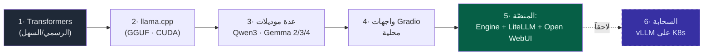

**المرحلة 1 — Hugging Face Transformers (نقطة الانطلاق الطبيعية).** بدأنا هنا لأنه المسار الرسمي والأكثر توثيقاً: `from_pretrained` وانتهى الأمر. مكّننا من إثبات المفهوم بسرعة (النموذج يعمل على الـ GPU)، لكنه كشف القيد الأول فوراً: على كرت بـ 6GB VRAM، تحميل النموذج بدقّة كاملة (FP16) يلتهم الذاكرة، والاستدلال ثقيل. Transformers مكتبة **بحثية/تدريبية** ممتازة، لكنها ليست محرّك خدمة (serving engine) مُحسّناً للذاكرة المحدودة.

**المرحلة 2 — الانتقال إلى llama.cpp (عبر `llama-cpp-python`، نسخة CUDA).** القيد (6GB VRAM) دفعنا نحو الـ **quantization**. صيغة GGUF مع llama.cpp تسمح بضغط نموذج من حجمٍ كبير إلى جزءٍ يسير منه (مثال معروف: ~30GB → ~4GB) مع إبقائه يعمل على الـ GPU عبر `n_gpu_layers`. هذا حوّل اللابتوب من "بالكاد يشغّل نموذجاً واحداً" إلى "يشغّل عدة نماذج بمرونة". اخترنا الـ Python bindings تحديداً لأنها تعطينا تحكّماً برمجياً في `n_ctx` و`n_gpu_layers` و`n_threads` — وهو ما نحتاجه لاحقاً في خطوط RAG.

**المرحلة 3 — تعدّد النماذج (Qwen3-0.6B/1.7B، Gemma 2 2B، Gemma 3 4B، Gemma 4 E2B التجريبي).** بمجرد أن صار التشغيل سهلاً، جرّبنا طيفاً من النماذج الصغيرة لنفهم المقايضة بين الحجم والجودة والسرعة على عتادنا. كلها عملت على الـ GPU. خرجنا بدرس عملي: لا يوجد "النموذج الأفضل" مطلقاً، بل أفضل نموذج *لكل مهمة وعتاد* — وهذا وحده مبرّرٌ كافٍ لوجود طبقة بوّابة تسمح بالتبديل بين النماذج لاحقاً.

**المرحلة 4 — واجهات Gradio محلية.** بنينا واجهات سريعة بـ Gradio لتجربة النماذج بشكلٍ تفاعلي. ممتازة للنماذج الأوّلية (prototyping)، لكنها واجهة *لكل سكربت*: لا مصادقة، لا إدارة مستخدمين، لا تتبّع تكلفة. أوضحت لنا الفجوة بين "أداة شخصية" و"منصّة فريق".

**المرحلة 5 — المنصّة (الآن).** تراكمت الدروس في مبدأٍ واحد: **وحّد كل شيء خلف واجهة OpenAI-compatible API، داخل حاويات Docker، بإعدادات خارجية (config-driven).** فصار المحرّك (llama.cpp اليوم) قابلاً للاستبدال خلف بوّابة LiteLLM، وفوقه واجهة Open WebUI للموظفين. هذا ما يجعل "نفس الشكل، صناديق أكبر" ممكناً.

> ✅ **الدرس الجوهري من الرحلة:** كل قيد عتادي دفعنا خطوةً نحو التجريد الصحيح. القيد (6GB) علّمنا أهمية فصل *المحرّك* عن *العميل*؛ وتعدّد النماذج علّمنا أهمية *البوّابة*؛ وواجهات Gradio علّمتنا أهمية *طبقة واجهة موحّدة بمصادقة*.

<a id="03-decisions-adr-log"></a>

### 3.2 سجل القرارات (ADR Log)

جدول مختصر بأسلوب Architecture Decision Record. كل صف = قرار واحد بسياقه وبدائله وحالته. التفاصيل الموسّعة للبدائل المرفوضة في [القسم 3.3](#03-decisions-rejected).

> ℹ️ هذه ملخّص قرارات الوثيقة المبكّر (ADR-01..ADR-08، ترقيم محلي تاريخي)؛ **السجلّ الرسمي المعتمد والمُعاد ترقيمه = [docs/DECISIONS.md](docs/DECISIONS.md) (ADR-001..025)** — راجعه لأي قرار وحالته الحالية.

| # | القرار | السياق | الخيارات المدروسة | الاختيار | السبب المختصر | الحالة |
|---|--------|--------|-------------------|----------|----------------|--------|
| ADR-01 | محرّك الاستدلال المحلي | كرت RTX 4050 بـ 6GB VRAM، 1–10 مستخدمين | Transformers · llama.cpp · vLLM · Ollama | **llama.cpp** (`llama-cpp-python`, CUDA) | الأكفأ/الأخف للنماذج الصغيرة على عتاد محدود؛ GGUF quantization؛ تحكّم برمجي | ✅ مُعتمد |
| ADR-02 | صيغة النماذج | تشغيل عدة نماذج على 6GB | FP16 كامل · GGUF مُكمّم | **GGUF** (مُكمّم) | يقلّص بصمة الذاكرة جذرياً مع إبقاء التشغيل على الـ GPU | ✅ مُعتمد |
| ADR-03 | عقد القابلية للنقل (API) | يجب التبديل/التوسّع بلا إعادة بناء | API خاص بكل محرّك · واجهة OpenAI-compatible موحّدة | **OpenAI-compatible API** | عقدٌ مستقرّ؛ تبديل المحرّك = تغيير `base_url` فقط | ✅ مُعتمد (المبدأ المركزي) |
| ADR-04 | طبقة البوّابة (Gateway) | مفاتيح/توجيه/حصص/تسجيل مركزي | بلا بوّابة · LiteLLM · Portkey · Kong | **LiteLLM Proxy** | MIT، self-host مجاني، 100+ مزوّد، يوحّد كل شيء خلف `/v1` | ✅ مُعتمد |
| ADR-05 | واجهة الموظفين | 1–10 مستخدمين، تبسيط | بناء من الصفر · Gradio · Open WebUI · LibreChat | **Open WebUI** | أنضج مجتمعاً، RBAC/SSO + RAG مدمج، يتعامل مع LiteLLM كـ backend عادي | ✅ مُعتمد |
| ADR-06 | التغليف والتشغيل | قابلية النقل بين محلي وسحابة | تشغيل native · Docker Compose · Kubernetes الآن | **Docker Compose** الآن، صورة واحدة قابلة للترقية إلى K8s لاحقاً | بسيط للمرحلة الأولى، نفس الحاويات تعمل سحابياً | ✅ مُعتمد |
| ADR-07 | محرّك السحابة المستقبلي | throughput تحت تزامن عالٍ | إبقاء llama.cpp · vLLM · SGLang · TensorRT-LLM | **vLLM** (الافتراضي السحابي) | continuous batching + PagedAttention؛ الافتراضي الآمن 2026 | 🔭 مُخطّط (ليس الآن) |
| ADR-08 | مزج موديلات مُدارة | مرونة الجودة/التكلفة مستقبلاً | self-host فقط · managed فقط · مزج عبر البوّابة | **مزج عبر LiteLLM** (Bedrock/Azure OpenAI/Vertex) | البوّابة تتيح المزج بلا لمس العملاء | 🔭 مُخطّط (ليس الآن) |

> ⚠️ القرارات الموسومة 🔭 **ليست مفعّلة الآن** — هي "أعمدة محجوزة في التصميم" نتركها متوافقة معها دون أن نبنيها قبل أوانها. تفعيلها يأتي حين تتحقّق شروطه (انظر [القسم 3.3](#03-decisions-rejected)).

<a id="03-decisions-rejected"></a>

### 3.3 بدائل مرفوضة، ولماذا

لكل بديل ثلاثة أعمدة بوعي: **لماذا بدا جذاباً** (حتى لا نستخف به)، **لماذا رُفض الآن** (القيد الواقعي)، و**متى نعيد النظر** (الشرط الموضوعي للعودة إليه). الرفض هنا *سياقي* لا مطلق.

<a id="03-decisions-rej-vllm-laptop"></a>

#### 3.3.1 vLLM على اللابتوب

- **لماذا بدا جذاباً:** vLLM هو الافتراضي الإنتاجي في 2026، بأداء throughput هائل (في اختبار H200 بـ 64 مستخدماً متزامناً أعطى ~44× ضعف tokens/sec مقارنةً بـ llama.cpp). من المغري "استخدام أداة الإنتاج من اليوم الأول".
- **لماذا رُفض الآن:**
  - لا يعمل native على ويندوز (يتطلب WSL2/Linux، تعقيد تشغيلي إضافي).
  - يحجز ~90% من الـ VRAM مسبقاً — قاتل على كرت 6GB، ويمنعنا من تشغيل عدة نماذج بمرونة.
  - ميزته الأساسية (throughput تحت تزامن عالٍ) **بلا قيمة لمستخدمٍ واحد أو لفريق صغير** — نحن في نطاق 1–10 مستخدمين حيث المعالجة شبه التسلسلية كافية.
- **متى نعيد النظر:** فور الانتقال للسحابة (ADR-07)، أو عند مشاركة GPU بين فريق يحتاج زمن استجابة متوقّعاً تحت حِمل. حينها vLLM هو الخيار الافتراضي تماماً.

<a id="03-decisions-rej-transformers-prod"></a>

#### 3.3.2 Transformers في الإنتاج

- **لماذا بدا جذاباً:** هو ما بدأنا به، ومألوف، ويغطّي أي نموذج تقريباً، ومدعوم رسمياً من Hugging Face.
- **لماذا رُفض الآن:** مكتبة بحث/تدريب لا محرّك خدمة. لا continuous batching ناضج، استهلاك ذاكرة أعلى، ولا واجهة OpenAI-compatible جاهزة للإنتاج. يكسر عقد القابلية للنقل (ADR-03).
- **متى نعيد النظر:** للتجارب البحثية، تحميل أوزان نادرة، أو نماذج لم تتوفّر بصيغة GGUF بعد — كأداة تطوير جانبية، **لا** كطبقة خدمة.

<a id="03-decisions-rej-ollama-only"></a>

#### 3.3.3 Ollama فقط (بلا بوّابة/واجهة منفصلة)

- **لماذا بدا جذاباً:** أبسط تجربة مطوّر على الإطلاق — `ollama run` وانتهى. يوفّر واجهة OpenAI-compatible جاهزة، وإدارة نماذج مريحة.
- **لماذا رُفض كحلٍّ وحيد:** Ollama طبقة **تجربة مطوّر (experience layer)**، لا منصّة فريق. يفتقر إلى المفاتيح الافتراضية (virtual keys)، والحصص (budgets/quotas)، والتسجيل المركزي، وتعدّد المستخدمين بمصادقة. كذلك ينهار تحت التزامن (معالجة شبه تسلسلية). الاعتماد عليه وحده يعني فقدان الحوكمة (governance).
- **متى نعيد النظر:** Ollama (أو `llama_cpp.server`) خلف LiteLLM خيارٌ ممتاز كـ *محرّك محلي* — وهو بالضبط دورنا الحالي. الرفض هو لـ "Ollama عارياً يواجه المستخدمين"، لا لـ Ollama كمحرّك خلف البوّابة.

<a id="03-decisions-rej-managed-only"></a>

#### 3.3.4 Managed API فقط (بلا self-host)

- **لماذا بدا جذاباً:** عملياً الخيار الأرخص والأقل جهداً لأغلب الحالات (تحليلٌ يذكر ~87% من الاستخدامات)؛ لا DevOps، لا عتاد، وصولٌ فوري لأحدث النماذج، ومرونة مع الحِمل المتقطّع. نقطة التعادل مع self-host لا تأتي إلا عند ملايين عديدة من الـ tokens شهرياً.
- **لماذا رُفض كحلٍّ وحيد:** يتعارض مع متطلب صريح للمشروع — **self-host للتطوير/التجريب الآن** والقدرة على إبقاء البيانات الحسّاسة داخلياً. الاعتماد الكلّي على مزوّد خارجي يعني فقدان السيطرة على البيانات، والتعرّض لقيود الامتثال/الإقامة (data residency)، وقفل المزوّد (vendor lock-in).
- **متى نعيd النظر:** ليس "إما/أو" بل "كلاهما". المعمارية تتيح المزج عبر LiteLLM (ADR-08): نماذج مستضافة داخلياً + نماذج مُدارة (Bedrock/Azure OpenAI/Vertex) خلف نفس البوّابة، لكل مهمة ما يناسبها.

<a id="03-decisions-rej-custom-ui"></a>

#### 3.3.5 بناء واجهة من الصفر

- **لماذا بدا جذاباً:** تحكّم كامل، تخصيص دقيق، "هويتنا الخاصة".
- **لماذا رُفض الآن:** إعادة اختراع العجلة. Open WebUI يقدّم مجاناً ما سيكلّفنا أشهراً: RBAC، SSO/OIDC، RAG مدمج، إدارة مستخدمين، ومجتمع ~124K نجمة. الأدلّة الميدانية صريحة: البناء الداخلي ينجح بنحو **ثلث** معدّل نجاح الشراء/الشراكة، والهندسة المفرطة (over-engineering) anti-pattern موسوم. وقتنا أثمن في طبقة الغراء (glue) المميِّزة، لا في صندوق دردشة.
- **متى نعيد النظر:** عند حاجة تخصيص لا يدعمها Open WebUI ولا إضافاته — وحتى حينها، الأرجح بناء *إضافة/امتداد* فوقه لا بديلٍ كامل عنه.

<a id="03-decisions-rej-no-gateway"></a>

#### 3.3.6 بلا بوّابة (الواجهة تكلّم المحرّك مباشرةً)

- **لماذا بدا جذاباً:** قطعة واحدة أقل، نشرٌ أبسط، زمن استجابة أقل بقفزة شبكية واحدة. ومع مستخدمٍ واحد يبدو "زائداً عن الحاجة".
- **لماذا رُفض الآن:** البوّابة هي **الركيزة المعمارية** بأكملها، لا قطعة اختيارية. بدونها: لا تبديل محرّك بتغيير URL واحد، ولا مزج محلي/مُدار، ولا مفاتيح/حصص/تسجيل مركزي، ولا إسناد تكلفة (cost attribution). أي عميل يكلّم المزوّد مباشرةً يكسر الحوكمة بالكامل. حذفها اليوم يعني إعادة بناءٍ غداً — وهو نقيض الشرط الذهبي للمشروع.
- **متى نعيد النظر:** لا نعيد النظر. هذا عمودٌ حامل. (التحذير المضادّ: لا نضخّم البوّابة بميزات لا نحتاجها بعد — نبدأ بالمصادقة والتوجيه الأساسي، ونضيف الحوكمة تدريجياً.)

<a id="03-decisions-rej-k8s-day-one"></a>

#### 3.3.7 Kubernetes من اليوم الأول

- **لماذا بدا جذاباً:** "ابنِ للتوسّع من البداية"؛ K8s هو معيار التشغيل السحابي، وفيه autoscaling (HPA/KEDA/Karpenter) وكثافة GPU (MIG/time-slicing).
- **لماذا رُفض الآن:** هندسة مفرطة وتحسين مبكّر صريح. لمستخدمٍ واحد على لابتوب، K8s يضيف تعقيداً تشغيلياً هائلاً (cluster، manifests، probes، secrets) بلا أي عائد. القابلية للنقل **لا** تأتي من K8s بل من **الصورة الواحدة غير القابلة للتغيير + الإعدادات الخارجية + عقد OpenAI-compatible**؛ وهذه نحقّقها بـ Docker Compose اليوم (ADR-06).
- **متى نعيd النظر:** عند الانتقال للسحابة والحاجة الحقيقية إلى autoscaling، توفّر عالٍ (HA)، أو مشاركة GPU عبر فريق. حينها *نفس الحاويات* تُرفع إلى EKS/AKS/GKE عبر NVIDIA GPU Operator، فيعمل نفس المنفست بطلب `nvidia.com/gpu` — انتقالٌ دون إعادة بناء.

> ✅ **الخيط الناظم للرفوضات السبعة:** كلّها رُفضت بالمبدأ نفسه — *ابدأ بسيطاً، واحفظ القابلية للنقل في العقد (API) لا في البنية التحتية الثقيلة*. ما رفضناه "الآن" محجوزٌ بشرطٍ واضح لـ"لاحقاً"، فلا نُفاجأ ولا نعيد بناءً.

<a id="04-architecture"></a>

## 4. المعمارية المستهدفة

تصف هذه الوثيقة الشكل النهائي للمنصّة كما اتُّفق عليه: أربع طبقات مفصولة بوضوح، يربطها عمود فقري واحد هو **واجهة OpenAI-compatible API**. هذا الفصل هو ما يجعل المبدأ المركزي ممكناً: *"نفس الشكل، صناديق أكبر"* — نبني التصميم الكامل اليوم بأبسط صناديق ممكنة، ثم نكبّر كل صندوق على حدة دون لمس البقية.

> 💡 استعارة ناطحة السحاب: ما يلي هو **التصميم المعماري** للمبنى بطوابقه. الطوابق نفسها لا تتغيّر عند الانتقال من نموذج مصغّر إلى مبنى حقيقي؛ ما يتغيّر هو حجم كل طابق ومواد بنائه. الأعمدة الحاملة — واجهة API الموحّدة وحاويات Docker والإعدادات الخارجية — تبقى ثابتة من اليوم الأول.

<a id="04-architecture-layers"></a>

### 4.1 المعمارية الطبقية (Layered Architecture)

نعتمد بنية مرجعية من **أربع طبقات** يتدفق الطلب عبرها من الأعلى إلى الأسفل:

```
[ الواجهة Frontend ]  →  [ البوّابة Gateway ]  →  [ الاستدلال Inference ]  →  [ الموديلات + التخزين Models & Storage ]
```

كل طبقة تتحدّث مع التي تليها عبر **عقد واحد فقط** (HTTP + OpenAI API)، ولا تعرف شيئاً عن تفاصيلها الداخلية. هذا الفصل (decoupling) هو جوهر القابلية للتوسّع والتبديل.

| # | الطبقة | المكوّن (الآن) | المسؤولية (بإيجاز) |
|---|--------|----------------|---------------------|
| 1 | **الواجهة** (Frontend / UX) | Open WebUI | واجهة الدردشة للموظفين؛ تسجيل الدخول (SSO لاحقاً)، RBAC، إدارة المحادثات، RAG. لا تتصل بأي محرّك مباشرةً — فقط بالبوّابة. |
| 2 | **البوّابة** (Gateway / Control Plane) | LiteLLM Proxy | نقطة الدخول الموحّدة الوحيدة. المصادقة، المفاتيح الافتراضية (virtual keys)، التوجيه (routing)، الحصص والميزانيات (budgets/quotas)، التسجيل (logging)، fallback. تعرض endpoint واحد OpenAI-compatible للجميع. |
| 3 | **الاستدلال** (Inference Engine) | `llama_cpp.server` | تشغيل الموديل فعلياً على الـ GPU وإنتاج التوكنات. يعرض هو الآخر `/v1` متوافقاً مع OpenAI. هو "الصندوق" الأسهل تكبيراً (→ vLLM). |
| 4 | **الموديلات + التخزين** (Models & Storage) | ملفات GGUF + PostgreSQL | الموديلات (أوزان GGUF محلياً)، وحالة البوّابة (مفاتيح/فرق/إنفاق) في PostgreSQL، و Redis (لاحقاً) لمزامنة الحصص بين النسخ. |

> ⚠️ القاعدة الحاكمة: **لا أحد يتجاوز البوّابة.** أي تطبيق داخلي أو script أو agent يجب أن يمرّ عبر LiteLLM بمفتاح افتراضي، لا بمفتاح مزوّد خام. تجاوز البوّابة = فقدان التتبّع والميزانيات وسجلّ التدقيق دفعةً واحدة.

<a id="04-architecture-component-diagram"></a>

### 4.2 مخطّط المكوّنات (Component Diagram)

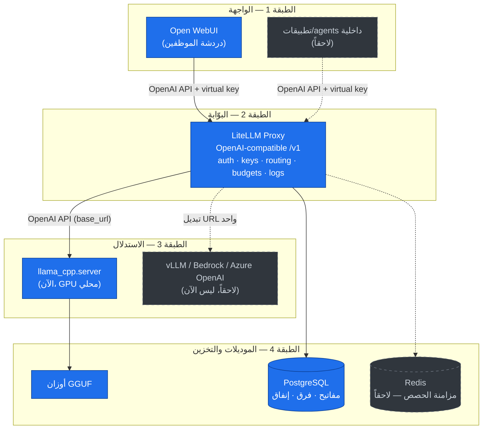

> 💡 لاحظ السهم المنقّط من البوّابة إلى السحابة: الانتقال للسحابة أو إضافة موديل مُدار **لا يلمس الواجهة ولا التطبيقات** — إنه تغيير في إعداد البوّابة فقط.

<a id="04-architecture-same-shape"></a>

### 4.3 مبدأ "نفس الشكل، صناديق أكبر"

الطبقات الأربع ثابتة. ما يتغيّر عند التوسّع هو **محتوى كل صندوق** فقط، بينما تبقى العقود (واجهة API، حاويات Docker، الإعدادات الخارجية) كما هي.

| الطبقة | الآن (لابتوب، 1–10 مستخدمين) | السحابة لاحقاً (الشركة، توسّع) | ما الذي **لا** يتغيّر |
|--------|------------------------------|--------------------------------|------------------------|
| الواجهة | Open WebUI (حاوية واحدة) | نفس الحاوية + SSO/OIDC + RBAC للفرق | الصورة (image) نفسها؛ نفس عقد OpenAI |
| البوّابة | LiteLLM (نسخة واحدة) | LiteLLM متعدّد النسخ خلف load balancer + Redis | نفس `config.yaml`، نفس `/v1` |
| الاستدلال | `llama_cpp.server` على RTX 4050 | vLLM على GPU سحابي (A10G/L4/H100) + autoscaling | عقد OpenAI API — **تغيير `base_url` واحد** |
| التخزين | PostgreSQL (حاوية) + ملفات GGUF | PostgreSQL مُدار + Redis + مخزن أوزان | مخطّط البيانات (schema) نفسه |
| التشغيل | Docker Compose | نفس الصور على Kubernetes (`nvidia.com/gpu`) | الصور الثابتة + الإعدادات الخارجية (12-factor) |

> ✅ المحصّلة العملية: تبديل المحرّك = سطر `base_url` واحد في إعداد البوّابة. الانتقال للسحابة = تشغيل **نفس الصور** على عتاد أكبر. لا إعادة بناء، ولا تعديل على الواجهة أو الكود الذي يستهلك الـ API.

> ⚠️ تذكير من دليل التفكير: كل ما هو في عمود "السحابة لاحقاً" هو **تصميم مُعَدّ سلفاً، لا تنفيذ مبكّر**. المرحلة الأولى تبقى بسيطة فعلاً: ثلاث حاويات (Open WebUI + LiteLLM + محرّك) و PostgreSQL. لا Kubernetes ولا Redis ولا autoscaling الآن. *(الآن: 4 خدمات فعليّة — open-webui · litellm · llamacpp · postgres؛ RAG/Memory عبر OWUI فعّالان — [ADR-025](docs/DECISIONS.md).)*

<a id="04-architecture-api-contract"></a>

### 4.4 عقد الواجهات (The OpenAI API Contract)

العمود الفقري الذي يحمل المبنى كلّه هو **واجهة OpenAI-compatible API**. كل طبقة تتكلّم بهذه اللغة، فيصبح أي مكوّن قابلاً للاستبدال ما دام يحترم العقد.

نقاط النهاية (endpoints) التي نلتزم بها كعقد محمول:

| Endpoint | الغرض |
|----------|-------|
| `POST /v1/chat/completions` | محادثة الدردشة (الأساسي) — يدعم streaming. |
| `POST /v1/completions` | إكمال نصّي بسيط (إرث/توافق). |
| `POST /v1/embeddings` | المتجهات لـ RAG. *(الآن: 4 خدمات؛ RAG/Memory عبر OWUI فعّالان — [ADR-025](docs/DECISIONS.md). تضمين OWUI محلّي خارج البوّابة، استثناء موثّق.)* |
| `GET  /v1/models` | قائمة الموديلات المتاحة — تظهر تلقائياً في منتقي Open WebUI. |

**قواعد الالتزام بالعقد:**

- [ ] كل عميل (UI/app/script) يُكتب مقابل واجهة OpenAI القياسية، مع `base_url` و `api_key` **خارجيَّين** (env vars)، لا قيم مضمّنة في الكود.
- [ ] لا يعتمد أي عميل على خصوصيات محرّك معيّن (quirks).
- [ ] الموديلات تُعرّف مركزياً في `model_list` داخل البوّابة، فتظهر للجميع باسم منطقي موحّد.

> ⚠️ مأزق شائع: ليست كل الميزات المتقدّمة محمولة بالكامل. السطح الأساسي (`chat/completions`) محمول، لكن تنسيقات **tool/function calling** و **structured output** و **logprobs** و **vision** تتفاوت بين المحرّكات. القاعدة: اختبر تحديداً نقاط النهاية التي يعتمدها عميلك **قبل** أي تبديل للمحرّك.

<a id="04-architecture-ports-network"></a>

### 4.5 خريطة المنافذ والشبكة (Ports & Network)

في Docker Compose تعيش كل المكوّنات على شبكة داخلية واحدة. المبدأ الأمني: **منفذ واحد فقط مكشوف للمستخدم** (الواجهة)، وكل ما عداه داخلي.

| المكوّن | المنفذ | الكشف | يصل إليه |
|---------|--------|-------|----------|
| Open WebUI | `3000` | مكشوف للموظفين (المتصفّح) | المستخدمون |
| LiteLLM Proxy | `4000` (`/v1`) | **داخلي فقط** (شبكة Docker) | Open WebUI، التطبيقات الداخلية |
| `llama_cpp.server` | `8000` (`/v1`) | **داخلي فقط** | LiteLLM حصراً |
| PostgreSQL | `5432` | **داخلي فقط** | LiteLLM حصراً |

> ⚠️ قاعدة أمنية غير قابلة للتفاوض: **لا تكشف منفذ البوّابة (LiteLLM) للإنترنت أبداً.** كُشِفَت ثغرات (pre-auth RCE/SQLi) في بوّابات مكشوفة. اجعل الوصول للبوّابة من داخل شبكة Docker فقط، ورقّع للنسخة المستقرّة الأحدث بسرعة.

> 💡 المنافذ أعلاه قابلة للتعديل عبر الإعدادات الخارجية؛ القيم هنا هي الافتراضات المتعارف عليها وتُستخدم لاحقاً في فصل التنفيذ.

<a id="04-architecture-request-lifecycle"></a>

### 4.6 دورة حياة الطلب (Request Lifecycle)

عندما يرسل موظف رسالة دردشة، يمرّ الطلب بالخطوات التالية:

1. **الإدخال:** الموظف يكتب رسالة في Open WebUI (المتصفّح → المنفذ `3000`). تكون جلسته موثّقة مسبقاً عبر تسجيل الدخول (SSO لاحقاً).
2. **التغليف:** Open WebUI يبني طلب `POST /v1/chat/completions` ويرسله إلى البوّابة على `http://litellm:4000/v1`، حاملاً **المفتاح الافتراضي** (virtual key) لا أي مفتاح خام.
3. **المصادقة والحوكمة في البوّابة:** LiteLLM يتحقّق من المفتاح، ويطبّق الحصص/الميزانية (budget/rpm/tpm)، ويسجّل البيانات الوصفية (metadata) للتدقيق.
4. **التوجيه:** بناءً على اسم الموديل المطلوب، تختار البوّابة الوجهة من `model_list` — اليوم محرّك llama.cpp المحلي الذي يخدم Gemma 4 (المعتمد: `http://llamacpp:8080/v1` — [compose/docker-compose.yml](compose/docker-compose.yml))؛ ولاحقاً قد يكون vLLM سحابياً أو موديلاً مُداراً، **بنفس الطلب تماماً**.
5. **الاستدلال:** المحرّك يحمّل السياق على الـ GPU، يولّد التوكنات، ويبثّها (streaming) عائدةً عبر العقد نفسه.
6. **العودة والتسجيل:** البوّابة تمرّر البثّ إلى الواجهة، تحدّث الإنفاق، وتغلق سجلّ الطلب. الموظف يرى الإجابة تتدفّق حرفاً حرفاً.

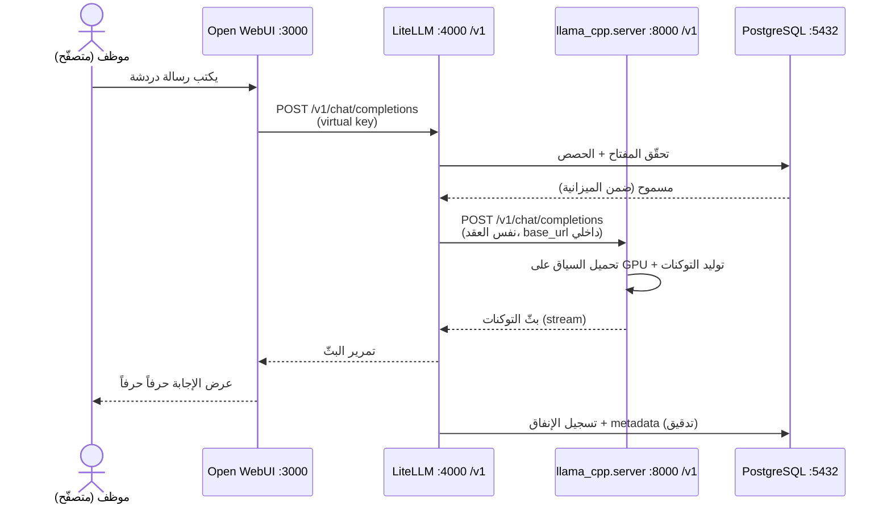

> ✅ الخلاصة المعمارية: الطلب يعبر العقد نفسه (OpenAI API) في كل قفزة. لذلك يكفي تغيير وجهة الخطوة 4 (URL واحد) لاستبدال المحرّك أو الانتقال للسحابة، دون أي أثر على الخطوات 1–3 أو على تجربة الموظف.

<a id="05-components"></a>

## 5. تفصيل المكوّنات

بعد أن وضعنا التصميم المعماري العام (الطابق الأرضي والأعمدة)، ننتقل الآن إلى "تفصيل كل طابق على حدة". هذا القسم هو الـ deep-dive الهندسي: لكل مكوّن نشرح **الدور** الذي يؤديه في المبنى، **لماذا اخترناه** من بين البدائل، **كيف يُضبط** (config إشاري)، **كيف يتوسّع** عند الانتقال للسحابة، و**كيف يُبدّل بأقل احتكاك**.

المبدأ الذي يربط كل ما يلي: العقد الثابت (the contract) هو واجهة **OpenAI-compatible API**. كل مكوّن يتكلّم هذه اللغة، فيصبح أي مكوّن قابلاً للاستبدال دون لمس بقية المبنى — "نفس السباكة، صناديق أكبر".

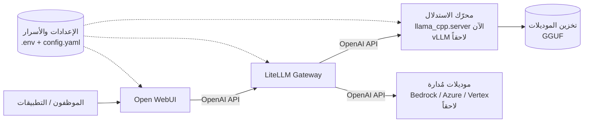

> 💡 لاحظ أن كل الأسهم الداخلية تحمل التسمية نفسها: `OpenAI API`. هذا التماثل المتعمّد هو ما يجعل التبديل لاحقاً مجرد تغيير عنوان URL واحد.

---

<a id="05-components-engine"></a>

### 5.1. محرّك الاستدلال (Inference Engine)

**الدور:** هو القلب النابض للمبنى — العضلة التي تحوّل أوزان الموديل (GGUF) إلى نصّ. يحمّل الموديل في الذاكرة (RAM/VRAM)، ينفّذ عملية التوليد (token generation)، ويعرض النتيجة عبر endpoint متوافق مع OpenAI على `/v1/chat/completions`.

**لماذا اخترنا `llama_cpp.server` الآن:** على لابتوب بـ 6GB VRAM ومستخدم واحد، llama.cpp هو الخيار الأكفأ والأخف. يدعم GGUF (ضغط الموديل من ~30GB إلى ~4GB)، يتيح التحكم الدقيق بـ `n_gpu_layers` لتوزيع الحمل بين GPU وCPU، ويأتي بخادم OpenAI-compatible جاهز عبر `python -m llama_cpp.server`. لا حاجة لـ throughput عالٍ في هذه المرحلة لأن المستخدم واحد.

**لماذا vLLM لاحقاً (ليس الآن):** vLLM هو الـ "default الآمن" للإنتاج في 2026. الفارق الحاسم هو **التزامن (concurrency)**: llama.cpp يعالج الطلبات بشكل تسلسلي وينهار تحت الحمل (في اختبار H200 بـ 64 مستخدماً متزامناً: vLLM أسرع بنحو 44 مرة، وllama.cpp تجاوز زمن أول token عنده 3 دقائق). vLLM يستخدم continuous batching + PagedAttention ليتوسّع مع التزامن. لكنه يحجز ~90% من VRAM ولا يعمل native على ويندوز — لذا هو قرار سحابي، لا قرار لابتوب.

| المعيار | llama.cpp (الآن) | vLLM (لاحقاً، سحابة) | SGLang (حالة خاصة) | TensorRT-LLM (متقدّم) |
|---|---|---|---|---|
| الحالة المثالية | 1–10 مستخدمين، GPU صغير | إنتاج، تزامن عالٍ | RAG / multi-turn / agentic (prefix كثيف) | موديل واحد ثابت، throughput أقصى |
| التزامن | تسلسلي فعلياً | continuous batching | RadixAttention (prefix caching) | batching متقدّم |
| ويندوز native | نعم | لا (Linux/WSL2) | لا | لا |
| التعقيد التشغيلي | منخفض جداً | متوسط | متوسط | عالٍ (بناء engine 10–30 دقيقة) |
| متى نلجأ إليه | المرحلة الأولى | الافتراضي للسحابة | سياق مشترك مكثّف | غير موصى به للبيئات متعددة الموديلات |

> ⚠️ تجنّب تشغيل llama.cpp كخادم إنتاج متعدد المستخدمين — هذا أكثر سوء-نشر شائع. وتجنّب TGI نهائياً للمشاريع الجديدة: هو الآن في وضع الصيانة (maintenance mode) وHugging Face نفسها توجّه نحو vLLM/SGLang/llama.cpp.

**كيف يُضبط (إشاري):**

> ℹ️ *(مثال إيضاحي/تاريخي — الإعداد المعتمد في [compose/docker-compose.yml](compose/docker-compose.yml): المحرّك الحالي صورة llama.cpp server تخدم **Gemma 4** على المنفذ **8080**، لا `llama_cpp.server`/Qwen على 8000.)*

```bash
# المرحلة الأولى — محلياً على الـ GPU (نموذج تاريخي؛ المعتمد = Gemma 4 على :8080)
python -m llama_cpp.server \
  --model /models/<gguf-model>.gguf \
  --n_gpu_layers -1 \      # حمّل كل الطبقات على الـ GPU إن أمكن
  --n_ctx 8192 \
  --host 0.0.0.0 --port 8000
# يعرض /v1/chat/completions و /v1/models
```

```bash
# لاحقاً — على GPU سحابي (نفس العقد، صندوق أكبر)
vllm serve <hf-model-id> --port 8000
```

**كيف يتوسّع:** أفقياً عبر تشغيل نسخ متعددة من الحاوية خلف الـ gateway (LiteLLM يوزّع الحمل). عمودياً عبر GPU أكبر (G5/L4 → A100/H100). على Kubernetes: طلب `nvidia.com/gpu` في الـ manifest، مع `--ipc=host`/`shm_size` كافٍ لـ tensor parallelism، وprobes طويلة لتحميل الموديل.

**كيف يُبدّل بأقل احتكاك:** المحرّك خلف الـ gateway مجرّد URL في `model_list`. التبديل من llama.cpp إلى vLLM = تغيير `api_base` في إعداد LiteLLM فقط. لا client ولا frontend يتأثّر، لأن العقد (`/v1`) ثابت.

> 💡 خيار وسيط لاحقاً: إن احتجت تشغيل عدة موديلات GGUF على GPU محدود، ضع `llama-swap` أمام llama.cpp — يبدّل الموديلات عند الطلب خلف endpoint واحد متوافق مع OpenAI.

---

<a id="05-components-gateway"></a>

### 5.2. البوّابة (LiteLLM Gateway)

**الدور:** هي "لوحة التحكم المركزية" و"المصعد الرئيسي" للمبنى. نقطة دخول/خروج واحدة (single OpenAI-compatible endpoint) يمرّ عبرها **كل** طلب — من Open WebUI، من السكربتات، من الـ agents. تتولّى: المصادقة (virtual keys)، التوجيه (routing)، الميزانيات والحصص (budgets/rate limits)، الـ fallbacks، والتسجيل المركزي للإنفاق (spend logging).

**لماذا اخترناه:** LiteLLM هو التوصية الافتراضية للبوّابات في الفرق ذاتية الاستضافة (MIT-licensed، مجاني، 100+ provider). يفصل العملاء عن المزوّدين، فيمكن إضافة موديل مُدار (Bedrock/Azure/Vertex) أو تبديل المحرّك المحلي دون لمس أي client. هو المكوّن الذي يحقّق "الشرط الذهبي": البناء من اليوم الأول بحيث يمكن المزج والتوسّع لاحقاً.

**البدائل:** Portkey (إذا أردت guardrails + semantic caching مُدمجة)، Kong AI Gateway (إذا كان لديك Kong mesh قائم)، Cloudflare AI Gateway (مُدار بالكامل على الحافة). لكنها كلها over-fit لنشر داخلي بسيط مقارنة بـ LiteLLM.

| الميزة | كيف تخدم المبنى |
|---|---|
| Virtual keys | مفتاح لكل فريق/تطبيق/مستخدم — مع `models[]`, `max_budget`, `rpm_limit`, expiration |
| Routing + fallbacks | أساسي محلي → احتياطي سحابي، شفّاف خلف نفس الـ API |
| Spend tracking | تتبّع إنفاق مركزي لكل المرور (UI + apps) عبر `team_id`/`tags` |
| تعدد المزوّدين | مزج موديل مستضاف مع موديل مُدار في نفس القائمة |

**كيف يُضبط (إشاري):**

> ℹ️ *(مثال إيضاحي/تاريخي — الإعداد المعتمد في [config/litellm/litellm-config.yaml](config/litellm/litellm-config.yaml): الموديل الحالي `Gemma 4` عبر `api_base: http://llamacpp:8080/v1`، لا Qwen عبر `engine:8000`.)*

```yaml
# litellm-config.yaml — هيكل إشاري (المعتمد: Gemma 4 على http://llamacpp:8080/v1)
model_list:
  - model_name: Gemma 4              # الاسم الذي يراه المستخدم
    litellm_params:
      model: openai/<model-id>
      api_base: http://llamacpp:8080/v1 # المحرّك المحلي — هذا السطر هو "مفتاح التبديل"
      api_key: dummy
  # لاحقاً: أضف موديلاً مُداراً دون لمس أي شيء آخر
  # - model_name: cloud-claude
  #   litellm_params: { model: bedrock/anthropic.claude-... }
litellm_settings:
  upperbound_key_generate_params: { max_budget: 50, max_parallel_requests: 4 }
```

```bash
# توليد مفتاح افتراضي لفريق (إشاري)
POST /key/generate
{ "models": ["Gemma 4"], "max_budget": 10, "budget_duration": "30d",
  "rpm_limit": 60, "team_id": "team-dev" }
```

> ⚠️ Virtual keys وbudgets وteams **تتطلّب PostgreSQL** — بدونه تحصل على proxy عديم الحالة فقط. وللنشر متعدد النسخ، Redis ضروري لمزامنة الحدود والميزانيات بدقة.

**كيف يتوسّع:** أفقياً (عدة نسخ خلف load balancer) مع Postgres للاتساق وRedis لمزامنة الحصص. نسخة واحدة تكفي مئات الطلبات/ثانية في المرحلة الأولى، لكن أبقها HA في الإنتاج لأن سقوط البوّابة = توقّف كل الوصول للـ AI.

**كيف يُبدّل بأقل احتكاك:** البوّابة نفسها نادراً ما تُبدّل (هي نقطة الثبات). التبديل يحدث **خلفها**: غيّر `api_base` للانتقال من llama.cpp إلى vLLM، أو أضف سطراً لموديل سحابي. العملاء لا يرون شيئاً سوى اسم الموديل.

> 🔐 تأمين أساسي: `LITELLM_MASTER_KEY` قوي، `LITELLM_SALT_KEY` لتشفير بيانات المزوّدين المخزّنة، **ولا تعرّض منفذ البوّابة للإنترنت أبداً** (سُجّلت ثغرات pre-auth خطيرة) — اجعل Open WebUI فقط يصل إليها داخل شبكة Docker.

---

<a id="05-components-frontend"></a>

### 5.3. الواجهة (Open WebUI)

**الدور:** هي "واجهة السكن" — المدخل الذي يستخدمه الموظفون يومياً. واجهة محادثة (chat) مع مصادقة، RBAC/SSO، وRAG مدمج. بالنسبة للمستخدم، تبدو وكأنها ChatGPT داخلي.

**لماذا اخترناها:** الافتراضي للواجهات ذاتية الاستضافة — أكبر مجتمع (~124K نجمة) وأنضج مجموعة ميزات للشركات. تتعامل مع LiteLLM كأي backend متوافق مع OpenAI: توجّه `OPENAI_API_BASE_URL` نحو endpoint البوّابة وتستخدم virtual key كـ `OPENAI_API_KEY`، فتظهر الموديلات تلقائياً في قائمة الاختيار.

**البدائل:** LibreChat (إن احتجت عدّة مزوّدي SSO جاهزين — Azure AD, Cognito, Keycloak, LDAP)، AnythingLLM (إن كان التركيز على document-Q&A/RAG).

**كيف يُضبط (إشاري):**

```bash
# ربط Open WebUI بالبوّابة — هذا كل ما يلزم للمرحلة الأولى
OPENAI_API_BASE_URL=http://litellm:4000/v1
OPENAI_API_KEY=sk-<litellm-virtual-key>
WEBUI_SECRET_KEY=<ثابت عبر النسخ>
WEBUI_URL=https://chat.company.internal

# لاحقاً — SSO عبر OIDC للهوية المؤسسية
# OPENID_PROVIDER_URL=...; OAUTH_CLIENT_ID=...; OAUTH_CLIENT_SECRET=...
# ENABLE_OAUTH_ROLE_MANAGEMENT=true; OAUTH_ADMIN_ROLES=...; OAUTH_GROUP_CLAIM=...
```

| طبقة الصلاحيات | الغرض |
|---|---|
| Roles (admin/user/pending) | فصل المدير عن المستخدم العادي |
| Groups (من IdP) | مزامنة مجموعات الهوية → صلاحيات على مستوى الموديل |
| Model-level permissions | كل فريق يرى فقط الموديلات المصرّح بها |
| Workspace isolation | عزل المعرفة (knowledge) بين الفرق |

> ⚠️ مصادقة الـ trusted-header (مثل `WEBUI_AUTH_TRUSTED_EMAIL_HEADER`) **قابلة للانتحال** — لا تستخدمها إلا خلف proxy مصادقة محكم (oauth2-proxy، Authelia، Cloudflare Access). وملاحظة: OIDC العام يدعم provider واحداً فقط عبر `OPENID_PROVIDER_URL`؛ إن احتجت عدّة، LibreChat أنسب.

**كيف يتوسّع:** نسخ متعددة خلف load balancer مع `WEBUI_SECRET_KEY` موحّد و`ENABLE_OAUTH_PERSISTENT_CONFIG` لإبقاء الإعداد في الـ DB. الإدارة تبقى في الـ IdP لا في الـ UI (Open WebUI يعيد مزامنة المجموعات عند كل تسجيل دخول ويستبدل التعديلات المحلية).

> 💡 لاحقاً، لـ RAG إنتاجي: استبدل Chroma الافتراضي بـ vector DB إنتاجي (PGVector/Qdrant/Milvus) ومحرّك استخراج حقيقي (Tika/Docling) — جودة الاسترجاع تتأثّر ماديّاً بهذين الخيارين.

---

<a id="05-components-storage"></a>

### 5.4. تخزين الموديلات (Model Storage)

**الدور:** هو "المخزن" حيث تُحفظ أوزان الموديلات (ملفات GGUF) ويصل إليها المحرّك عند التحميل. في المرحلة الأولى مجلّد على القرص؛ لاحقاً مساحة تخزين سحابية مشتركة.

**لماذا GGUF محلياً:** الصيغة المثلى للاستدلال المُقيَّد بالذاكرة — تضغط الموديل بشكل كبير (مثال: ~30GB → ~4GB) عبر التكميم (quantization)، وهو ما يجعل تشغيل موديلات متعددة على 6GB VRAM ممكناً أصلاً. نختار مستوى التكميم (مثل Q4) كموازنة بين الجودة والذاكرة.

| المرحلة | آلية التخزين | كيف يصل إليها المحرّك |
|---|---|---|
| الآن (لابتوب) | مجلّد `/models` على القرص | bind mount في Docker |
| لاحقاً (سحابة) | تخزين سحابي (S3/Blob/GCS) أو volume مشترك | تحميل عند بدء الحاوية أو PVC على K8s |

**كيف يُضبط (إشاري):** يُمرَّر المجلّد للحاوية كـ volume، والمسار يُحقن عبر متغيّر بيئة لا hard-code:

> ℹ️ *(مثال إيضاحي/تاريخي — الإعداد المعتمد في [compose/docker-compose.yml](compose/docker-compose.yml) و[config/env/.env.example](config/env/.env.example): الخدمة اسمها `llamacpp`، والمسار يأتي من `MODEL_DIR`/`MODEL_FILE` لملفّ Gemma 4 GGUF.)*

```yaml
# docker-compose (إشاري — الخدمة المعتمدة اسمها llamacpp)
services:
  engine:
    volumes:
      - ${MODELS_DIR:-./models}:/models:ro   # المسار قابل للتبديل عبر env
    environment:
      - MODEL_PATH=/models/<gguf-model>.gguf
```

**كيف يتوسّع:** من قرص محلي → volume مشترك على الشبكة → object storage سحابي (يُحمَّل الموديل عند بدء الحاوية، أو يُربط كـ PVC). على K8s قد تستخدم MIG/time-slicing لزيادة كثافة الـ GPU، لكن مصدر الموديل يبقى منفصلاً عن الحاوية.

**كيف يُبدّل بأقل احتكاك:** لأن المسار يأتي من env لا من الكود، التبديل من قرص محلي إلى S3 = تغيير قيمة `MODELS_DIR`/`MODEL_PATH` ومنطق التحميل في الحاوية فقط. الموديل نفسه (GGUF) قد يتغيّر لاحقاً إلى أوزان كاملة (FP16) عند الانتقال لـ vLLM — وهذا يتم بتبديل المحرّك (5.1)، لا بتغيير العملاء.

> 💡 لاحظ تراخيص الموديلات: Gemma 4 وأمثاله Apache-friendly، بينما بعض الموديلات تشترط شروطاً (تسجيل، عدم تدريب). سجّل ترخيص كل موديل في المخزن — "لاحقاً، ليس الآن" للحوكمة الكاملة، لكن دوّنه من الآن.

---

<a id="05-components-config"></a>

### 5.5. الإعدادات والأسرار (Config & Secrets)

**الدور:** هي "المخططات والمفاتيح" التي تجعل المبنى نفسه يعمل في أي موقع. مبدأ 12-factor: **كل** ما يختلف بين البيئات (أسماء الموديلات، العناوين، المفاتيح، الميزانيات) يأتي من خارج الصورة (env vars / mounted secrets / config files)، ولا شيء cloud-specific يُخبز داخل الحاوية.

**لماذا هذا حاسم:** هذا هو المكوّن الذي يحوّل "الشرط الذهبي" من شعار إلى واقع. صورة واحدة immutable تُرقّى dev → staging → prod، والفرق الوحيد بين اللابتوب والسحابة هو ملف الإعداد ومصدر الأسرار. لو خبزنا region أو bucket أو ARN في الكود، لانهار مبدأ النقل وأُجبرنا على إعادة البناء.

| نوع المحتوى | أين يعيش (الآن) | أين يعيش (السحابة) |
|---|---|---|
| إعداد التوجيه | `litellm-config.yaml` | نفسه (ConfigMap على K8s) |
| متغيّرات البيئة | `.env` | env في الـ manifest |
| الأسرار (مفاتيح، DB URL) | `.env` (محلي، غير مُحكَم) | secret manager عبر External Secrets Operator (ESO) |

**كيف يُضبط (إشاري):**

```bash
# .env (المرحلة الأولى) — يُحقن في الحاويات، لا يُخبز فيها
LITELLM_MASTER_KEY=sk-...
LITELLM_SALT_KEY=...           # تشفير بيانات المزوّدين المخزّنة
DATABASE_URL=postgresql://...  # مطلوب لـ keys/teams/spend
MODELS_DIR=./models
```

**كيف يتوسّع:** الانتقال للسحابة لا يغيّر شكل الإعداد، بل **مصدره** فقط. على K8s: ConfigMap للإعداد غير الحسّاس، وESO كطبقة تجريد واحدة فوق AWS Secrets Manager / Azure Key Vault / GCP Secret Manager — تعرّف `SecretStore` لكل سحابة وتبقى موارد `ExternalSecret` متطابقة، فتبديل السحابة = تبديل الـ backend فقط.

> ⚠️ Kubernetes Secrets الأصلية مُرمّزة بـ base64 فقط (غير مشفّرة في etcd افتراضياً وقابلة للقراءة عبر kubectl) — لا تعاملها كمخزن أسرار حقيقي؛ فعّل التشفير at-rest و/أو استخدم ESO مع مدير أسرار حقيقي.

**كيف يُبدّل بأقل احتكاك:** بما أن كل المكوّنات السابقة (المحرّك، البوّابة، الواجهة) تقرأ إعدادها من هذه الطبقة، فإن **معظم عمليات التبديل والتوسّع في هذا المبنى كلّه تتحوّل إلى تعديل قيمة هنا** — لا تعديل كود. هذا هو جوهر التصميم config-driven: المبنى ثابت، والمخططات قابلة للتبديل.

> ✅ قائمة تحقّق للمرحلة الأولى:
> - [ ] كل المكوّنات تتكلّم `/v1` (OpenAI-compatible) — لا استثناء
> - [ ] لا قيمة cloud-specific مخبوزة في أي صورة أو كود
> - [ ] منفذ LiteLLM غير مكشوف للإنترنت؛ Open WebUI فقط يصل إليه
> - [ ] PostgreSQL مفعّل للبوّابة (keys/teams/spend)
> - [ ] `LITELLM_MASTER_KEY` و`LITELLM_SALT_KEY` و`WEBUI_SECRET_KEY` مضبوطة
> - [ ] الأسرار في `.env` محلياً، مع مسار واضح للترقية إلى ESO لاحقاً

<a id="06-phases"></a>

## 6. مراحل التنفيذ (مراحل البناء)

هذا القسم هو **خارطة البناء التنفيذية**: كيف ننتقل من تصميم على الورق إلى ناطحة سحاب مأهولة، طابقاً بعد طابق. المبدأ الحاكم في كل المراحل واحد: **"نفس الشكل، صناديق أكبر"** — العقد الثابت هو واجهة OpenAI-compatible API، والتغيير بين المراحل هو تبديل صناديق (محرّك استدلال، عتاد) خلف نفس الواجهة، وليس إعادة بناء.

> 💡 الفلسفة المرحلية: لا تبنِ الطابق العاشر قبل أن يسكن أحد الطابق الأول. كل مرحلة تُطلَق، تُستخدَم فعلاً، وتُثبِت قيمتها قبل الانتقال للتالية. ~95% من مشاريع GenAI تفشل لأسباب تشغيلية/هيكلية (لا جودة الموديل): معايير نجاح ضعيفة، وبقاء في "مطهر البايلوت". المراحل أدناه مصمّمة لتجنّب ذلك عبر **معايير خروج صريحة وقابلة للقياس**.

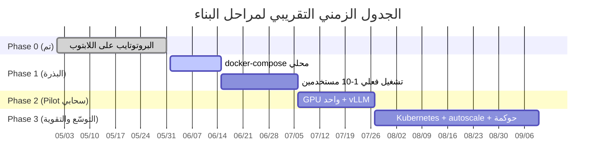

> ⚠️ تحذير مهم على طول الطريق: **لا تضخّم Phase 1.** البذرة يجب أن تبقى بسيطة فعلاً (docker-compose واحد). كل ما هو HA/Kubernetes/SSO/PII مؤجَّل صراحةً إلى Phase 3. أي محاولة لإقحام أدوات المرحلة 3 في المرحلة 1 هي over-engineering ("مطرقة لكسر جوزة").

---

<a id="06-phases-overview"></a>

### 6.0 نظرة عامة على المراحل

| المرحلة | الاسم | العتاد | محرّك الاستدلال | التزامن | الهدف الرئيسي |
|---|---|---|---|---|---|
| **Phase 0** | البروتوتايب (تم) | لابتوب RTX 4050 6GB | Transformers ← llama.cpp | مستخدم واحد | إثبات الجدوى التقني |
| **Phase 1** | البذرة (Seed) | نفس اللابتوب/خادم صغير | `llama_cpp.server` | 1–10 (تتابعي) | منصّة داخلية حقيقية بأقل تعقيد |
| **Phase 2** | Pilot سحابي | GPU سحابي واحد (G5/L4) | **vLLM** | عشرات متزامنة | إثبات قابلية النقل + الأداء تحت الحمل |
| **Phase 3** | التوسّع والتقوية | Kubernetes + GPU autoscale | vLLM/SGLang (+ managed مزيج) | مئات | إنتاج مؤسسي: HA، حوكمة، أمان |

العمود الفقري الثابت عبر كل المراحل: **LiteLLM Proxy** (البوّابة) + **Open WebUI** (الواجهة). هذان لا يتغيّران؛ يتغيّر فقط ما خلف `base_url` في إعداد البوّابة.

---

<a id="06-phases-phase0"></a>

### 6.1 Phase 0 — البروتوتايب (مكتمل)

#### الهدف
إثبات أن موديلات صغيرة (Qwen3-0.6B/1.7B، Gemma 2/3) تعمل فعلاً على عتاد متواضع (RTX 4050 6GB) وتُنتج مخرجات مفيدة.

#### لماذا وُجدت
تقليل المخاطرة قبل أي إنفاق: قبل تصميم منصّة، نتأكّد أن الفكرة قابلة للتنفيذ على العتاد المتاح، ونفهم سلوك GGUF/الكمّ (quantization) وحدود الـ VRAM.

#### ما تحقّق (Deliverables)
- ✅ تشغيل Transformers أولاً (المسار الرسمي/السهل) للفهم.
- ✅ الانتقال إلى llama.cpp عبر `llama-cpp-python` (نسخة CUDA) — الأكفأ لموديلات صغيرة على 6GB.
- ✅ تشغيل عدة موديلات GGUF على الـ GPU بنجاح.
- ✅ واجهات تجريبية بـ Gradio.
- ✅ قرار مدروس باستبعاد vLLM **للابتوب** (لا تعمل native على ويندوز، تحجز ~90% VRAM، ميزتها throughput لا تنفع مستخدماً واحداً) — مع الإبقاء عليها كخيار **سحابي** لاحق.

#### معيار الخروج (تم استيفاؤه)
> ✅ موديل واحد على الأقل يردّ بشكل مفيد على الـ GPU محلياً، وفهمنا حدود العتاد والكمّ.

#### ما لا ننقله من هذه المرحلة
Gradio لا يُرحَّل — كان أداة استكشاف فقط. الواجهة الرسمية من Phase 1 فصاعداً هي Open WebUI.

---

<a id="06-phases-phase1"></a>

### 6.2 Phase 1 — البذرة (Seed): docker-compose محلي

> هذه هي **الأرضية والأعمدة** للمبنى كله. نضع هنا الأساس الذي ستقف عليه كل الطوابق العليا: العقد الثابت (OpenAI API)، البوّابة، الواجهة، والإعدادات الخارجية. أبقها بسيطة.

#### الهدف
منصّة داخلية **حقيقية وقابلة للاستخدام** لـ 1–10 مستخدمين، بأقل تعقيد ممكن، مبنية بحيث تتوسّع لاحقاً دون إعادة بناء.

#### لماذا توجد أصلاً
لننتقل من "سكربت على لابتوب" إلى "خدمة" يستخدمها الفريق فعلاً — مع وضع الأعمدة الثلاثة للنقل من اليوم الأول: (1) واجهة OpenAI-compatible موحّدة، (2) حاويات Docker، (3) إعدادات خارجية (config-driven).

#### المتطلبات المسبقة
- Docker Desktop مع **WSL2 backend** (شرط passing الـ GPU على ويندوز).
- داخل WSL2: تثبيت **`cuda-toolkit-12-x` فقط** — لا تثبّت Linux NVIDIA driver إطلاقاً (يكسر `/dev/dxg`).
- تحقّق: `docker run --rm --gpus=all nvcr.io/nvidia/k8s/cuda-sample:nbody nbody -gpu -benchmark`.
- ملفات GGUF للموديلات (من Phase 0).

#### الخطوات التفصيلية المرقّمة
1. **هيكل المستودع (config-driven):** أنشئ مجلداً واحداً يحوي `docker-compose.yml`، و`litellm-config.yaml`، و`.env` (لا أسرار في الصور أبداً)، ومجلد `models/` للملفات GGUF.
2. **محرّك الاستدلال:** عرّف خدمة `llama_cpp.server` تشغّل GGUF وتكشف `/v1` (OpenAI-compatible). اضبط `n_gpu_layers`, `n_ctx` عبر env. احجز الـ GPU في compose عبر `deploy.resources.reservations.devices` (driver: nvidia, capabilities: [gpu]).
3. **البوّابة LiteLLM:** عرّف خدمة LiteLLM؛ في `litellm-config.yaml` اجعل الموديل المحلي عنصراً في `model_list` يشير إلى `http://llamacpp:8000/v1`. هذا الـ `base_url` هو **نقطة التبديل الوحيدة** مستقبلاً.
4. **حالة البوّابة:** أضف **PostgreSQL** (شرط المفاتيح/الميزانيات/التتبّع) عبر `DATABASE_URL`. اضبط `LITELLM_MASTER_KEY` و`LITELLM_SALT_KEY`.
5. **الواجهة Open WebUI:** عرّف الخدمة واربطها بالبوّابة: `OPENAI_API_BASE_URL=http://litellm:4000/v1` و`OPENAI_API_KEY=<litellm-virtual-key>`. اضبط `WEBUI_SECRET_KEY`.
6. **عزل الشبكة:** اجعل منفذ LiteLLM داخلياً على شبكة Docker فقط — **لا تكشفه للإنترنت**. المنفذ المكشوف الوحيد هو Open WebUI.
7. **مفاتيح افتراضية:** أصدر virtual key واحداً للواجهة عبر `POST /key/generate` بميزانية مبدئية صغيرة.
8. **التشغيل والتحقق:** `docker compose up -d`؛ أول مستخدم يسجّل في Open WebUI يصبح admin؛ تأكّد أن الموديل يظهر في منتقي الموديلات ويردّ.

#### المخرجات (Deliverables)
- [ ] `docker-compose.yml` يشغّل ثلاث خدمات (llama_cpp.server + LiteLLM + Open WebUI) + Postgres.
- [ ] `litellm-config.yaml` يوجّه لموديل محلي واحد عبر `base_url`.
- [ ] `.env` لكل الأسرار/الإعدادات.
- [ ] واجهة دردشة شغّالة يصلها الفريق على الشبكة المحلية.

#### معايير القبول/الخروج (Exit Criteria)
> ✅ الفريق (1–10) يستخدم الواجهة فعلياً ويحصل على ردود مفيدة، وكل الطلبات تمرّ عبر LiteLLM (لا اتصال مباشر بالمحرّك)، وتبديل المحرّك ممكن نظرياً بتغيير سطر `base_url` واحد.

#### خطة التراجع (Rollback)
- بسيطة بحكم الطبيعة: `docker compose down` يعيدك للصفر دون أثر. الأسرار في `.env` والحالة في حجم Postgres (volume) قابل للنسخ الاحتياطي.
- إن فشل المحرّك على الـ GPU، عُد مؤقتاً لتشغيل CPU بخفض `n_gpu_layers` — تتدهور السرعة لكن الخدمة تبقى.

#### ⚠️ ما الذي لا نفعله عمداً الآن (تجنّب التضخيم)
- ❌ **لا Kubernetes، لا Terraform، لا HA** — حاوية واحدة لكل خدمة تكفي تماماً.
- ❌ **لا vLLM** — لا تنفع لمستخدم/مستخدمين على 6GB وتحجز VRAM دون فائدة.
- ❌ **لا SSO/OIDC، لا PII redaction، لا Redis** — مؤجَّلة كلها إلى Phase 3.
- ❌ **لا vector DB إنتاجي/RAG معقّد** — إن لزمت تجربة RAG، اتركها بأبسط صورة. ("لاحقاً، ليس الآن.") *(الآن: 4 خدمات؛ RAG/Memory عبر OWUI المدمج فعّالان — [ADR-025](docs/DECISIONS.md).)*
- ❌ لا تكشف منفذ البوّابة، ولا تستخدم trusted-header auth (قابل للانتحال).

---

<a id="06-phases-phase2"></a>

### 6.3 Phase 2 — Pilot سحابي: GPU واحد + تبديل المحرّك لـ vLLM

> هنا نختبر أهم وعد معماري: **"نفس الحاويات، صندوق أكبر".** ننقل المبنى نفسه إلى أرض أوسع (GPU سحابي) ونستبدل محرّك الطابق الأرضي فقط.

#### الهدف
إثبات قابلية النقل عملياً، والانتقال من محرّك تتابعي (llama.cpp) إلى محرّك بـ continuous batching (vLLM) لتحمّل التزامن.

#### لماذا توجد أصلاً
llama.cpp/Ollama تعالج الطلبات **تتابعياً** وتنهار تحت الحمل (في اختبار H200 بـ 64 مستخدماً متزامناً: vLLM ~44× tokens/sec أكثر، وTTFT لـ llama.cpp تجاوز 3 دقائق). بمجرّد مشاركة GPU عبر فريق أو الحاجة لزمن استجابة متوقّع تحت الحمل، vLLM هو الخيار الافتراضي الآمن لـ 2026.

#### المتطلبات المسبقة
- نجاح Phase 1 واستيفاء معايير خروجها.
- حساب سحابي + GPU instance واحد مناسب للاستدلال (مثل AWS G5 بـ A10G 24GB، أو GCP G2/L4).
- معرفة بحجم الموديل المطلوب لاختيار الـ VRAM.

#### الخطوات التفصيلية المرقّمة
1. **توفير GPU واحد:** أنشئ instance واحداً بـ GPU (يدوياً أو بـ Terraform مبكّر — اختياري). ثبّت NVIDIA driver + NVIDIA Container Toolkit + Docker.
2. **استبدال خدمة المحرّك:** في `docker-compose.yml` استبدل خدمة `llama_cpp.server` بصورة `vllm/vllm-openai`. أضف `ipc: host` أو `shm_size` كبيراً (شرط tensor parallelism في vLLM).
3. **تغيير السطر الواحد:** في `litellm-config.yaml`، حدّث `base_url` للموديل ليشير إلى خدمة vLLM الجديدة. **هذا هو التبديل كله** على مستوى البوّابة.
4. **اختيار صيغة الموديل:** vLLM تفضّل أوزان HF (FP16/AWQ/...) لا GGUF غالباً — هيّئ اسم الموديل ومعاملاته (`max-model-len`, `dtype`, `tensor-parallel-size`) عبر env (12-factor).
5. **التحقق من التكافؤ:** اختبر **تحديداً** الـ endpoints التي يعتمدها عملاؤك (chat/completions، وtool/function-calling، والـ streaming) — فالميزات المتقدّمة تتفاوت بين المحرّكات وليست كلها قابلة للتبديل تلقائياً.
6. **اختبار الحمل:** شغّل اختبار تزامن بسيط (عشرات الطلبات المتزامنة) وقارن throughput/TTFT بـ Phase 1.
7. **المزج الاختياري:** أضف في البوّابة موديلاً managed (Bedrock/Azure OpenAI/Vertex) كـ fallback لإثبات قدرة LiteLLM على المزج والتوجيه.

#### المخرجات (Deliverables)
- [ ] نفس `docker-compose` يعمل على GPU سحابي مع vLLM.
- [ ] `litellm-config.yaml` معدّل (سطر `base_url` فقط) + معاملات vLLM في `.env`.
- [ ] تقرير اختبار حمل: throughput وTTFT تحت تزامن.
- [ ] (اختياري) مسار fallback لموديل managed يعمل.

#### معايير القبول/الخروج (Exit Criteria)
> ✅ نفس عملاء Phase 1 يعملون **دون تغيير في الكود** (تغيّر فقط الإعداد)؛ وvLLM يخدم عشرات الطلبات المتزامنة بـ TTFT مقبول؛ والـ endpoints الحرجة (tool-calling/streaming) مُختبَرة وتعمل.

#### خطة التراجع (Rollback)
- البوّابة هي شبكة الأمان: أعِد `base_url` إلى محرّك llama.cpp المحلي (أو احتفظ به كـ fallback في `model_list`) فتعود الخدمة فوراً.
- إن تعذّر vLLM على الموديل المطلوب، استخدم موديلاً managed عبر البوّابة مؤقتاً (نفس الواجهة، صفر تغيير للعملاء).
- أوقف الـ GPU instance لإيقاف التكلفة فوراً (الحالة في Postgres محفوظة/منسوخة).

#### ⚠️ ما الذي لا نفعله عمداً الآن
- ❌ **لا Kubernetes بعد** — GPU واحد + docker-compose يكفي لإثبات النقل والأداء. K8s مرحلة لاحقة.
- ❌ **لا autoscaling/scale-to-zero** — لا معنى له بـ GPU واحد.
- ❌ **لا شراء عتاد** — استخدم سحابة بالساعة (H100 ~$1–7/ساعة)؛ الاقتصاد لا يبرّر الشراء قبل أحجام ضخمة جداً (managed يفوز حتى مليارات التوكنات شهرياً).
- ❌ لا تترك الـ GPU عاملاً بلا استخدام (GPU بـ 10% استغلال يضاعف الكلفة/التوكن ~10×) — أوقفه عند عدم الحاجة.

---

<a id="06-phases-phase3"></a>

### 6.4 Phase 3 — التوسّع والتقوية (الطوابق العليا + التشطيب)

> الآن فقط — بعد إثبات النقل والأداء — نبني الطوابق العليا: التوسّع التلقائي، التوافر العالي، الحوكمة والأمان. هذا هو **التشطيب والصيانة** الذي يحوّل المبنى إلى ناطحة سحاب مأهولة بأمان.

#### الهدف
الانتقال إلى إنتاج مؤسسي: مئات المستخدمين، توافر عالٍ (HA)، توسّع تلقائي حسب الطلب، وحوكمة/أمان كاملة — مع بقاء نفس عقد OpenAI API.

#### لماذا توجد أصلاً
عند مشاركة العتاد عبر فرق متعددة وظهور متطلبات الامتثال والميزانيات والتدقيق، تصبح الحاوية الواحدة نقطة فشل وحيدة (أي عطل للبوّابة يوقف كل الوصول). نحتاج تنسيقاً (orchestration)، وتوسّعاً، وطبقات حوكمة.

#### المتطلبات المسبقة
- نجاح Phase 2 (نفس الصورة تعمل على GPU سحابي).
- طلب/حمل حقيقي يبرّر التعقيد (لا تدخل هذه المرحلة استباقياً).
- IdP مؤسسي (OIDC) جاهز للـ SSO.

#### الخطوات التفصيلية المرقّمة
1. **Kubernetes مُدار:** انقل **نفس صورة vLLM** إلى EKS/AKS/GKE. ثبّت **NVIDIA GPU Operator** (يهيّئ device plugin) واطلب GPU عبر المفتاح المحمول `resources.limits["nvidia.com/gpu"]` — نفس الـ manifest عبر الثلاث سحابات.
2. **متانة الإقلاع/الإيقاف:** اضبط `startupProbe` طويلاً (تحميل الموديل دقائق) و`terminationGracePeriodSeconds` 300+ (600+ للـ streaming) مع `preStop` لتصريف الطلبات الجارية (rollout بلا انقطاع).
3. **التوسّع الطبقي:** **KEDA** يوسّع الـ pods على عمق الطابور/الطلبات الجارية (لا CPU)؛ **Karpenter** يوفّر عُقد GPU just-in-time ويُنزِلها إلى صفر عند الخمول؛ MIG/time-slicing لزيادة الكثافة.
4. **التوافر العالي للبوّابة:** شغّل LiteLLM **بعدة نسخ** خلف load balancer، وأضف **Redis** لمزامنة الحصص/الميزانيات عبر النسخ بدقّة (Postgres يبقى للحالة).
5. **الحوكمة في البوّابة:** مفاتيح افتراضية لكل فريق/مستخدم مع `max_budget`+`budget_duration`، و`rpm/tpm` limits، وsقوف عبر `upperbound_key_generate_params`، وtags للإسناد المحاسبي، وتسجيل **metadata فقط** (لا تسجيل محتوى كامل = بحيرة PII).
6. **الأمان والهوية:** فعّل **SSO/OIDC** في Open WebUI (`OPENID_PROVIDER_URL`, `OAUTH_CLIENT_ID/SECRET`) مع `ENABLE_OAUTH_ROLE_MANAGEMENT`/`GROUP_MANAGEMENT` لربط مجموعات الـ IdP بصلاحيات الموديلات. أبقِ منفذ البوّابة غير مكشوف للإنترنت أبداً، ورقّع بسرعة (CVEs في البوّابات خطيرة).
7. **الأسرار الموحّدة:** استخدم **External Secrets Operator** فوق AWS Secrets Manager/Azure Key Vault/GCP Secret Manager — تبقى موارد `ExternalSecret` متطابقة، يتغيّر الـ backend فقط عند تبديل السحابة.
8. **المراقبة:** Prometheus + Grafana + **DCGM exporter** لمراقبة الـ GPU، وتنبيهات على الطابور/الكلفة/الاستغلال.
9. **المزج والتوجيه:** فعّل routing+fallbacks في LiteLLM (مثل self-hosted أساسي ← managed احتياطي) لمرونة الموديلات.
10. **RAG إنتاجي (إن لزم):** استبدل Chroma الافتراضي بـ vector DB إنتاجي (PGVector/Qdrant/Milvus) ومحرّك استخلاص حقيقي (Tika/Docling).

#### المخرجات (Deliverables)
- [ ] manifests Kubernetes محمولة + GPU Operator + KEDA + Karpenter.
- [ ] LiteLLM HA (نسخ متعددة) + Redis + Postgres.
- [ ] SSO/OIDC مفعّل + RBAC على مستوى الموديلات/المجموعات.
- [ ] External Secrets Operator موصول بمدير أسرار سحابي.
- [ ] لوحات Prometheus/Grafana/DCGM + تنبيهات.
- [ ] سياسات ميزانيات/حصص/تدقيق فعّالة لكل فريق.

#### معايير القبول/الخروج (Exit Criteria)
> ✅ سقوط أي pun بوّابة/استدلال واحد لا يقطع الخدمة؛ والنظام يتوسّع تلقائياً مع التزامن ويُنزِل عُقد GPU إلى صفر عند الخمول؛ والوصول كله عبر SSO + virtual keys مع ميزانيات وتدقيق؛ والأسرار في مدير أسرار (لا في etcd خام).

#### خطة التراجع (Rollback)
- **النشر تدريجي:** rollout متدرّج (canary) مع إبقاء إصدار سابق جاهز؛ أي خلل → rollback فوري للنسخة السابقة (نفس الصورة المثبّتة بالـ digest).
- **التراجع المعماري:** لأن الصورة والعقد متطابقان مع Phase 2، يمكن — في كارثة — العودة لتشغيل نفس الحاويات على GPU سحابي واحد (docker-compose) كوضع طوارئ.
- **الميزانيات كصمام أمان:** سقوف الإنفاق وتعطيل المفاتيح (`/key/block`) يحدّان الضرر فوراً.

#### ⚠️ ما الذي لا نفعله عمداً الآن
- ❌ **لا TensorRT-LLM** إلا لموديل واحد ثابت طويل الأمد يبرّر بناء engine (10–30 دقيقة) وإعادة الترجمة عند أي تغيير — يقتل المرونة في بيئة متعددة الموديلات.
- ❌ **لا Cluster Autoscaler التقليدي** (بطيء/جامد) — Karpenter أسرع وأكفأ.
- ❌ **لا توسيع على CPU metric** — لا يعكس حمل الـ GPU؛ وسّع على الطابور/استغلال الـ GPU.
- ❌ **لا شراء عتاد مبكّر بلا سقوف إنفاق** — استخدم reserved/committed للأحمال الثابتة وspot للمقاطعة، والكلفة الحقيقية = 2.5–3× إيجار الـ GPU الخام.
- ❌ **لا تبدأ مشاريع جديدة على TGI** (وضع صيانة في 2026).

---

> ✅ خلاصة المراحل: البذرة بسيطة وحقيقية (Phase 1)، ثم نثبت النقل والأداء على صندوق أكبر (Phase 2)، ثم نقوّي ونوسّع فقط عندما يبرّر الطلب ذلك (Phase 3) — وفي كل خطوة، العقد الثابت (OpenAI API) والبوّابة (LiteLLM) هما ما يجعل كل انتقال "تغيير إعداد" لا "إعادة بناء".

<a id="07-security"></a>

## 7. الأمان والحوكمة

> ✅ **المبدأ الحاكم لهذا القسم:** الأمان في "ناطحة السحاب" ليس طبقة تُضاف في الأعلى عند التشطيب؛ بل هو نظام السباكة المحمية والأبواب المضادة للحريق الذي يُمدّ في الجدران من اليوم الأول. لكن مدّ الأنابيب لا يعني تشغيل كل صنابير المبنى دفعةً واحدة. نضع **المسارات** (واجهة موحّدة، بوّابة مركزية، أسرار خارجية) منذ Phase 1، ونفتح **الضوابط المتقدّمة** (SSO, audit, PII redaction, HA) حين يستدعيها الحِمل والمخاطر فعلاً — لا قبل ذلك.

في معماريّتنا، **البوّابة (LiteLLM) هي نقطة التحكّم الأمنية المركزية** (control plane). كل طلب — من Open WebUI أو من أي تطبيق/سكربت داخلي — يمرّ عبرها بمفتاح افتراضي (virtual key)، لا بمفتاح المزوّد الخام. هذا يمنحنا نقطة واحدة نفرض عندها المصادقة، الحصص، التسجيل، والتوجيه. تجاوُز البوّابة = فقدان الحوكمة بالكامل.

> ⚠️ **خطر مرحلي:** أكبر مزلق أمني عملي في هذه البنية هو **تعريض منفذ LiteLLM (`:4000`) للإنترنت قبل المصادقة**. تاريخياً ظهرت في بوّابات الـ LLM ثغرات pre-auth خطيرة (SQLi/RCE). القاعدة المطلقة: المنفذ لا يُعرَّض للإنترنت أبداً، ويُرَقَّع بسرعة عند صدور إصدار مستقر جديد.

---

<a id="07-security-authn-authz"></a>

### 7.1 المصادقة والصلاحيات (authN / authZ)

نفصل بوضوح بين مصادقة **البشر** ومصادقة **الآلات**، لأنهما يدخلان النظام من بابين مختلفين:

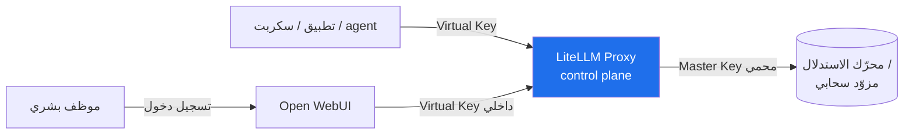

| الطبقة | من يصادق | الآلية في Phase 1 | الآلية عند التوسّع |
|---|---|---|---|
| **مصادقة البشر** | موظفو الشركة | تسجيل دخول Open WebUI المدمج (email/password)؛ أول مستخدم = admin | SSO عبر OIDC مع IdP الشركة (Azure AD / Okta / Keycloak) |
| **تفويض البشر** | الـ admin | أدوار Open WebUI الثلاثة (admin / user / pending) | RBAC كامل: groups + model-level permissions + workspace isolation، مُشتقّة من claims الـ IdP |
| **مصادقة الآلات** | البوّابة | Virtual key لكل تطبيق/سكربت | نفسها + تدوير منتظم + نطاق models[] مقيّد لكل مفتاح |

**Phase 1 (يكفي فعلاً):** فعّل مصادقة Open WebUI المدمجة، واجعل التسجيل بدعوة لا مفتوحاً (`ENABLE_SIGNUP=false` بعد إنشاء الحسابات الأولى). لا حاجة لـ SSO الآن مع 1–10 مستخدمين.

> 💡 **عند التوسّع، لا قبله:** انتقل إلى OIDC عبر `OPENID_PROVIDER_URL` + `OAUTH_CLIENT_ID/SECRET`، وفعّل `ENABLE_OAUTH_ROLE_MANAGEMENT` (مع `OAUTH_ROLES_CLAIM` / `OAUTH_ADMIN_ROLES`) وربط المجموعات عبر `ENABLE_OAUTH_GROUP_MANAGEMENT` + `OAUTH_GROUP_CLAIM`. انتبه: Open WebUI يدعم **مزوّد OIDC واحداً فقط** في الوقت ذاته، ويُعيد مزامنة عضوية المجموعات من الـ IdP عند كل دخول (تعديلاتك اليدوية في الواجهة تُمحى) — أدِر المجموعات في الـ IdP لا في الواجهة.

> ⚠️ مصادقة الترويسة الموثوقة (`WEBUI_AUTH_TRUSTED_EMAIL_HEADER`) **قابلة للانتحال**: إن كان التطبيق قابلاً للوصول مباشرة، يستطيع أي أحد انتحال أي مستخدم. لا تستخدمها إلا خلف بروكسي مصادقة محكم (oauth2-proxy / Authentik / Cloudflare Access).

---

<a id="07-security-keys"></a>

### 7.2 مفاتيح API الافتراضية ودورانها

المفتاح الافتراضي (virtual key) هو وحدة الهوية والحوكمة للآلات. القاعدة الذهبية: **لا يلمس أي مستهلك مفتاح المزوّد الخام أبداً** — مفاتيح المزوّدين تعيش فقط داخل البوّابة.

**مفتاح واحد لكل (فريق / تطبيق / مستخدم)**، مع نطاق ومحدّدات صريحة عبر `POST /key/generate`:

```bash
# يصدره الـ admin بمفتاح master فقط (الموديل المعتمد حالياً = "Gemma 4" — config/litellm/litellm-config.yaml)
POST /key/generate
Authorization: Bearer sk-<master-key>
{
  "models": ["Gemma 4"],                     # نطاق مقيّد (مثال: أسماء الموديلات المعرّفة في البوّابة)
  "max_budget": 20, "budget_duration": "30d",
  "rpm_limit": 60, "tpm_limit": 100000,
  "max_parallel_requests": 4,
  "team_id": "team-research",                # الميزانية على الفريق
  "duration": "90d",                          # انتهاء صلاحية = تدوير إجباري
  "metadata": {"owner": "data-pipeline"}, "tags": ["billing:rnd"]
}
```

| الضابط | Phase 1 | عند التوسّع |
|---|---|---|
| إصدار المفاتيح | مفتاح واحد لـ Open WebUI + مفتاح/سكربت | مفتاح لكل فريق/تطبيق مع `team_id` لاحتساب الميزانية |
| النطاق (`models[]`) | اختياري | إلزامي — كل مفتاح يرى نماذجه فقط |
| انتهاء الصلاحية | يدوي | `duration` إلزامي + سقوف عبر `upperbound_key_generate_params` |
| من يصدر المفاتيح | الـ admin يدوياً | تقييد عبر `key_generation_settings.team_key_generation.allowed_team_member_roles: ['admin']` |
| التدوير (rotation) | عند الحاجة (تسريب/مغادرة موظف) | دوري + فوري عبر `POST /key/block` ثم إصدار بديل |

> 💡 **حوكمة استباقية:** اضبط `litellm_settings.upperbound_key_generate_params` كسقف تنظيمي لا يمكن لأي مفتاح مُولَّد ذاتياً تجاوزه، و`default_key_generate_params` للقيم الافتراضية الآمنة. هذا يمنع "مفتاحاً بلا سقف" من إفراغ الميزانية. التدوير التلقائي الكامل (`auto_rotate`) ميزة في الطبقة المؤسسية المدفوعة — ليس الآن.

---

<a id="07-security-secrets"></a>

### 7.3 إدارة الأسرار

الأسرار في نظامنا: `LITELLM_MASTER_KEY`، `LITELLM_SALT_KEY` (يشفّر بيانات اعتماد المزوّدين المخزّنة)، `DATABASE_URL`، `WEBUI_SECRET_KEY`، ومفاتيح المزوّدين السحابيين (Bedrock/Azure/Vertex).

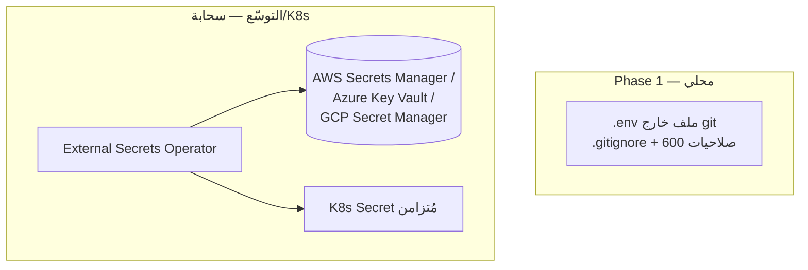

| الضابط | Phase 1 | عند التوسّع |
|---|---|---|
| التخزين | ملف `.env` خارج التحكّم بالإصدار (`.gitignore`) | مدير أسرار سحابي عبر External Secrets Operator (ESO) |
| `LITELLM_MASTER_KEY` | قوي وعشوائي (`sk-...`) | نفسه + تدوير دوري |
| تشفير بيانات الاعتماد | `LITELLM_SALT_KEY` مضبوط منذ اليوم الأول | نفسه (لا تغيّره بعد التخزين وإلا تتعطّل فكفكة التشفير) |
| `WEBUI_SECRET_KEY` | مضبوط وثابت | ثابت عبر كل النسخ المتماثلة (replicas) |

> ⚠️ **مزلق K8s:** الـ Secrets الأصلية في Kubernetes مُرمّزة بـ base64 فقط (ليست مشفّرة) وتُخزَّن في etcd وتُقرأ عبر `kubectl`. لا تعاملها كخزنة أسرار — فعّل encryption-at-rest و/أو استخدم ESO مع مدير أسرار حقيقي.

> 💡 منذ Phase 1: لا تضع أي سرّ في الصورة (image) أو في `config.yaml` أو في كود التطبيق — كله يأتي من متغيّرات البيئة وقت التشغيل (مبدأ 12-factor). هذا ما يجعل نفس الصورة قابلة للنقل للسحابة دون إعادة بناء.

---

<a id="07-security-logging-pii"></a>

### 7.4 سياسة تسجيل الطلبات/الردود والـ PII

هنا يكمن أخطر توتّر: التسجيل يفيد المراقبة والتدقيق، لكن **تسجيل المحتوى الكامل يحوّل قاعدة بيانات السجلّات إلى بحيرة بيانات PII** (أسماء، إيميلات، بيانات عملاء) — مسؤولية قانونية وأمنية ثقيلة.

سياستنا المتدرّجة:

| الضابط | Phase 1 | عند التوسّع |
|---|---|---|
| ما يُسجَّل | **بيانات وصفية فقط (metadata):** الهوية، الموديل، عدد الـ tokens، الكلفة، الطابع الزمني، زمن الاستجابة، حالة النجاح | نفسه + لوحات مراقبة (Prometheus/Grafana) |
| محتوى الطلب/الرد | **لا يُسجَّل كاملاً افتراضياً** | تسجيل انتقائي/مؤقّت فقط مع تنقيح PII، احتفاظ محدود المدّة |
| تنقيح PII (redaction) | غير مطلوب (لا محتوى مُسجَّل) | PII masking عند البوّابة (Phase 3) قبل أي تخزين |
| الإسناد (attribution) | لكل virtual key/مستخدم | لكل team/tag للتقارير المالية والأمنية |

> ✅ القاعدة العملية للمرحلة الأولى: **سجّل "من فعل ماذا ومتى وكم كلّف" — لا "ماذا قال".** هذا يكفي للحوكمة والميزانية، ويُبقيك بعيداً عن مخاطر الـ PII دون أي جهد إضافي.

> ⚠️ تنبيه أمني: الـ guardrails على مستوى البوّابة (تصفية كلمات/محتوى) **لا تكفي وحدها** — هجمات prompt-injection وprompt-leakage تتجاوزها. عند الحاجة، تُضاف دفاعات على جانب الموديل + إشراف بشري. هذا شأن متقدّم: **لاحقاً، ليس الآن.**

---

<a id="07-security-network"></a>

### 7.5 عزل الشبكة

المبدأ: **سطح هجوم بحجم باب واحد.** المكوّن الوحيد المعرَّض للموظفين هو Open WebUI؛ كل ما عداه (LiteLLM، المحرّك، PostgreSQL، Redis) يعيش داخل شبكة Docker الخاصة، غير قابل للوصول من الخارج.

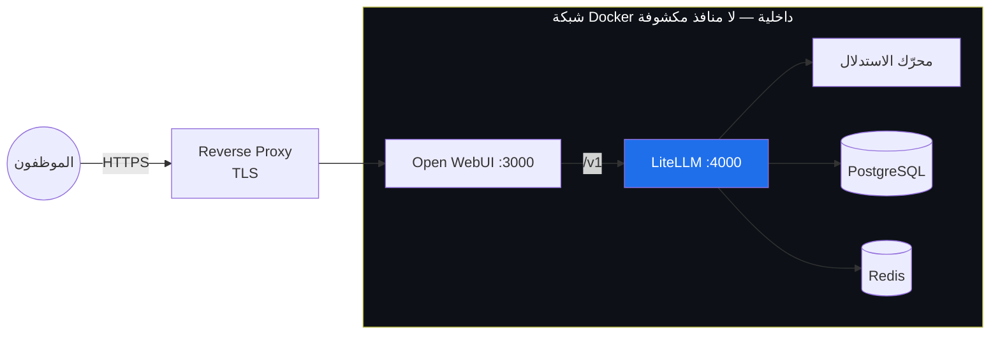

| الضابط | Phase 1 | عند التوسّع |
|---|---|---|
| منفذ LiteLLM `:4000` | **غير مكشوف** — يُوصَل إليه فقط داخل شبكة Docker | داخل cluster network / mesh فقط |
| منفذ المحرّك / PostgreSQL / Redis | داخلي فقط | داخلي فقط + NetworkPolicies في K8s |
| الواجهة العامة | Open WebUI فقط، خلف reverse proxy بـ TLS | نفسه + WAF + (اختياري) two-tier gateway (perimeter + model-serving) |
| التشفير أثناء النقل | TLS على الواجهة العامة | TLS طرف-لطرف داخل الـ mesh |

> ✅ في compose، لا تنشر (`ports:`) إلا لـ Open WebUI؛ بقية الخدمات تتواصل بأسماء الخدمات داخل الشبكة (مثل `http://litellm:4000/v1`).

---

<a id="07-security-licenses"></a>

### 7.6 حوكمة تراخيص الموديلات

النموذج ليس "مجانياً" لمجرّد أنه مفتوح الأوزان. الترخيص يحدّد ما يُسمح به تجارياً، وما إذا كان يجوز ضبطه (fine-tune) أو إعادة توزيعه. هذا التزام قانوني يجب أن يُسجَّل **قبل** إدخال أي موديل للإنتاج.

| الموديل | الترخيص | الاستخدام التجاري | الضبط/إعادة التوزيع | ملاحظة حوكمية |
|---|---|---|---|---|
| Gemma 4 (E2B) | Apache 2.0 | ✅ مسموح بوضوح | ✅ مرن | الأكثر أماناً قانونياً |
| Gemma 1–3 (2B/3 4B) | **Gemma Terms** (مخصّصة) | ✅ مع التزام بشروط الاستخدام المحظور | مسموح ضمن الشروط | اقرأ بنود الاستخدام المحظور والإسناد |
| Qwen3 (0.6B/1.7B) | Apache 2.0 (تحقّق per-model) | ✅ | ✅ | تحقّق من ترخيص كل إصدار على حدة |
| Llama (إن استُخدم) | Llama Community License | مشروط (سقف MAU) | قيود على الضبط/التوزيع | راجع شرط الـ MAU قبل الاعتماد |

> 💡 **سياسة عملية (تنطبق حتى في Phase 1):** احتفظ بـ "سجلّ موديلات" بسيط (جدول/ملف) يقيّد لكل موديل: الترخيص، رابطه، تاريخ الإقرار، وسقف الإنفاق. القاعدة الافتراضية الآمنة: **فضّل موديلات Apache 2.0** (Gemma 4, Qwen3) لتجنّب التعقيد القانوني، واستخدم الموديلات ذات التراخيص المخصّصة فقط بعد قراءة بنودها صراحةً.

> ⚠️ لا تفترض أن "مفتوح + محلي = بلا التزامات". Gemma Terms تفرض قيود استخدام محظور، وLlama يفرض شروطاً تجارية — تجاهلها مخاطرة قانونية حقيقية.

---

<a id="07-security-audit"></a>

### 7.7 سجلّ التدقيق (Audit)

سجلّ التدقيق يجيب عن السؤال الحوكمي الأساسي: **من فعل ماذا، متى، وبأي تكلفة؟** في معماريّتنا تُولّده البوّابة طبيعياً لأنها نقطة المرور الوحيدة.

| الضابط | Phase 1 | عند التوسّع |
|---|---|---|
| تخزين السجلّ | PostgreSQL (مطلوب أصلاً لمفاتيح/فِرق/إنفاق LiteLLM) | نفسه + تصدير لنظام SIEM/مراقبة مركزي |
| محتوى السجلّ | metadata: الهوية، المفتاح، الموديل، tokens، الكلفة، الوقت | نفسه + ربط بهوية الـ IdP (audit by identity) |
| الاستعلام | `/key/info`, `/user/info`, `/team/info`, `/spend/*` | لوحات + تنبيهات تجاوز الميزانية + تقارير دورية |
| الاحتفاظ والنزاهة | احتفاظ أساسي | سياسة احتفاظ + سجلّات غير قابلة للتعديل (append-only) |

> ⚠️ سجلّ التدقيق المتقدّم (audit logs مفصّلة، SCIM provisioning، تقارير الامتثال) في Open WebUI مُتاح في الطبقة المؤسسية المدفوعة. للمرحلة الأولى، سجلّ LiteLLM في PostgreSQL يكفي تماماً للإسناد والحوكمة المالية.

---

<a id="07-security-summary"></a>

### 7.8 جدول المرجع: الضابط الأمني × المرحلة

| الضابط الأمني | Phase 1 (1–10 مستخدمين) | عند التوسّع (فريق/سحابة) |
|---|---|---|
| مصادقة البشر | Open WebUI مدمج، تسجيل مغلق | SSO / OIDC من IdP الشركة |
| تفويض البشر | أدوار (admin/user) | RBAC + groups + model permissions من claims |
| مصادقة الآلات | virtual key لـ Open WebUI + سكربت | مفتاح لكل team/app، نطاق `models[]` إلزامي |
| تدوير المفاتيح | يدوي عند الحاجة | دوري + `duration` + سقوف upperbound |
| إدارة الأسرار | `.env` خارج git، salt key مضبوط | External Secrets Operator + مدير أسرار سحابي |
| تسجيل الطلبات | metadata فقط، بلا محتوى | + تسجيل انتقائي مع PII masking |
| تنقيح PII | غير مطلوب | masking عند البوّابة (Phase 3) |
| عزل الشبكة | LiteLLM غير مكشوف، Open WebUI خلف TLS | NetworkPolicies + WAF + (اختياري) two-tier |
| تراخيص الموديلات | سجلّ موديلات بسيط، تفضيل Apache 2.0 | حوكمة تراخيص رسمية + سقوف إنفاق |
| سجلّ التدقيق | LiteLLM + PostgreSQL (metadata) | تصدير SIEM + audit by identity + append-only |
| توافر البوّابة (HA) | نسخة واحدة كافية | نسخ متعددة + Redis لمزامنة الحصص/الميزانيات |

> ✅ **الخلاصة:** في Phase 1 تكفي ستة ضوابط بسيطة لكنها غير قابلة للتفاوض: (1) Open WebUI خلف مصادقة، (2) LiteLLM غير مكشوف للإنترنت، (3) virtual keys بدل المفاتيح الخام، (4) أسرار في `.env` خارج git مع salt key، (5) تسجيل metadata فقط، (6) سجلّ موديلات مع تفضيل Apache 2.0. كل ما عدا ذلك — SSO, PII masking, ESO, HA, SIEM — مُخطَّط له في الأنابيب لكن **يُفتح عند التوسّع، لا الآن.** هذا هو جوهر "نفس الشكل، صناديق أكبر": المسارات الأمنية ممدودة من اليوم الأول، والصنابير تُفتح بحسب الحاجة.

<a id="08-operations"></a>

## 8. التشغيل والمراقبة والتكلفة

بعد أن اكتمل بناء ناطحة السحاب وسكنها الموظفون، يبدأ العمل الحقيقي: **الصيانة بعد السكن**. لا تُقاس المنصّة بيوم إطلاقها، بل بقدرتها على البقاء صحيّة وواضحة التكلفة على مدى الأشهر. هذا القسم يضع لوحة التحكّم (المراقبة)، وأنظمة الإنذار (فحوص الصحة والـ runbooks)، وعدّاد الكهرباء (نموذج التكلفة) التي تُبقي المبنى يعمل دون مفاجآت.

> 💡 المبدأ الحاكم هنا: **البوّابة (LiteLLM) هي مصدر الحقيقة**. لأن كل حركة المرور تمرّ عبرها (راجع [المعمارية](#04-architecture)), فهي المكان الطبيعي لقياس التوكنات والتكلفة والكمون لكل مستخدم — دون الحاجة لأدوات منفصلة لكل محرّك.

---

<a id="08-operations-observability"></a>

### 8.1 المراقبة: ماذا نقيس ومن أين

المراقبة ثلاث طبقات (الركائز الثلاث للـ observability)، لكن في المرحلة الأولى لا نحتاجها كلها بنفس العمق. ابدأ بما يجيب عن سؤالين فقط: **هل النظام حيّ؟** و**كم ينفق ومن؟**

| الطبقة | ماذا تقيس | المصدر العملي (المرحلة 1) | لاحقاً (سحابة) |
|---|---|---|---|
| **Metrics** | توكنات/طلب، طلبات/ثانية، كمون (latency)، أخطاء، استهلاك GPU | `/metrics` من LiteLLM + `nvidia-smi` | Prometheus + DCGM exporter |
| **Logs** | من طلب ماذا ومتى (metadata فقط) + أخطاء المحرّك | جدول `spend logs` في LiteLLM (PostgreSQL) | تجميع مركزي (Loki) |
| **Tracing** | تتبّع الطلب عبر الطبقات (UI → بوّابة → محرّك) | غير ضروري الآن | OpenTelemetry عبر LiteLLM |

> ⚠️ **لا تُسجّل محتوى الرسائل (prompts/completions) بالكامل.** التسجيل الكامل يحوّل قاعدة بياناتك إلى "بحيرة بيانات PII" (مخاطرة خصوصية وامتثال). سجّل الـ metadata فقط: الهوية، الموديل، عدد التوكنات، الزمن، رمز الحالة. هذا قرار يجب أن يُتّخذ من اليوم الأول.

#### أهم المقاييس عملياً (الـ "golden signals" لخدمة LLM)

- **TTFT** (Time To First Token): زمن وصول أول توكن — أهم مؤشر لتجربة المستخدم في البث (streaming).
- **TPOT / tokens/sec**: سرعة توليد التوكنات بعد البدء.
- **Throughput**: طلبات وتوكنات في الثانية إجمالاً.
- **GPU utilization & VRAM**: نسبة استخدام الكرت والذاكرة — مؤشر التشبّع الحقيقي.
- **Error rate**: نسبة الأخطاء (5xx، timeouts، نفاد الذاكرة).
- **Token spend per key/team**: العمود الفقري لمراقبة التكلفة وكشف إساءة الاستخدام.

> 💡 على الكرت المحلي (RTX 4050 بـ 6GB)، راقب **VRAM قبل كل شيء**. تجاوز سعة الذاكرة لا يُبطئ النظام تدريجياً، بل يُسقط الطلب فوراً (out-of-memory). راقبه بأمر بسيط: `nvidia-smi --query-gpu=utilization.gpu,memory.used,memory.total --format=csv -l 5`.

---

<a id="08-operations-health"></a>

### 8.2 فحوص الصحة (Health Checks)

كل حاوية يجب أن تُعلن عن صحتها. هذه أساس أي إعادة تشغيل تلقائي الآن، وأساس probes في Kubernetes [لاحقاً](#06-phases-phase3).

| المكوّن | فحص الصحة | ملاحظة |
|---|---|---|
| محرّك llama.cpp | `GET /v1/models` يعيد 200 | تحميل الموديل قد يستغرق دقائق — اسمح بمهلة بدء طويلة |
| بوّابة LiteLLM | `GET /health/liveliness` و `GET /health` | `/health` يفحص اتصال المحرّكات الخلفية فعلياً |
| Open WebUI | `GET /health` | يعتمد على وصوله للبوّابة |
| PostgreSQL | `pg_isready` | حالة البوّابة (مفاتيح/ميزانيات) تعتمد عليه |

> ⚠️ افصل بين **liveliness** (هل العملية حيّة؟) و**readiness** (هل جاهزة لاستقبال طلبات؟). في خدمة LLM الفرق جوهري: العملية قد تكون حيّة بينما الموديل ما زال يُحمَّل في الـ VRAM ولا يستطيع الرد بعد. اضبط `startupProbe` بمهلة عالية حتى لا يُقتل الـ pod أثناء تحميل الموديل ويدخل في حلقة انهيار (crash loop).

في المرحلة 1 عبر `docker-compose`، يكفي بلوك `healthcheck` بسيط لكل خدمة مع `restart: unless-stopped`.

---

<a id="08-operations-backup"></a>

### 8.3 النسخ الاحتياطي

السؤال الأساسي: **ما الذي يؤلم فقدانه؟** ليس كل شيء يحتاج نسخاً.

| المورد | يُنسخ؟ | لماذا / كيف |
|---|---|---|
| **PostgreSQL** (LiteLLM) | ✅ نعم، يومياً | المفاتيح، الفِرَق، الميزانيات، سجلّات الإنفاق — لا يمكن إعادة توليدها. `pg_dump` يومي |
| **قاعدة بيانات Open WebUI** | ✅ نعم | المحادثات، المستخدمون، إعدادات RBAC |
| **config.yaml و .env** | ✅ نعم (في Git/secret manager) | إعدادات التوجيه والأسرار — هي "المخطط المعماري" |
| **ملفات GGUF** | ❌ لا | قابلة لإعادة التنزيل؛ احفظ فقط قائمة بأسمائها/إصداراتها |
| **حاويات Docker** | ❌ لا | معرّفة بـ tags؛ أعد بناءها من الـ image |

> 💡 قاعدة عملية: انسخ **الحالة (state)** لا **الأشياء القابلة لإعادة الإنتاج (artifacts)**. الموديلات والصور قابلة للاستعادة؛ مفاتيح وميزانيات المستخدمين لا. اختبر الاستعادة فعلياً مرة على الأقل — نسخة احتياطية لم تُختبر ليست نسخة احتياطية.

---

<a id="08-operations-runbooks"></a>

### 8.4 Runbooks مختصرة

> ℹ️ **runbook التشغيل المعتمد والمحدّث = [docs/RUNBOOK.md](docs/RUNBOOK.md)** (الستاك الحيّ: 4 خدمات، الأعطال الشائعة، توليد مفتاح OWUI، تدفّق RAG/Memory). الأوامر أدناه **رؤية-أصلية/إيضاحية** (حقبة `engine:8000`) — للحقائق التشغيلية الجارية اعتمد RUNBOOK وملفّات `compose/`·`config/`.

دليل مفاهيمي سريع لأنماط الأعطال (المنفذ/الأسماء المعتمدة في RUNBOOK: المحرّك `llamacpp` على `:8080`):

**🔴 المحرّك لا يستجيب / أخطاء 5xx من البوّابة**
1. افحص صحة المحرّك داخل الشبكة (المعتمد: `llamacpp:8080` — إيضاحي: `http://localhost:8000/v1/models`).
2. افحص سجلّ الحاوية: `docker compose logs llamacpp --tail 100`.
3. ابحث عن `CUDA out of memory` → الموديل/السياق أكبر من الـ VRAM.
4. الحل السريع: قلّل `CTX_SIZE` أو حمّل موديلاً أصغر أو أعد التشغيل `docker compose restart llamacpp`.

**🔴 بطء شديد / TTFT مرتفع**
1. هل عدد المستخدمين المتزامنين ارتفع؟ llama.cpp يُسلسل الطلبات فعلياً وينهار تحت التزامن.
2. افحص `nvidia-smi` — هل الكرت مشبع 100%؟
3. الحل المؤقت: قائمة انتظار / تقليل التزامن. الحل الجذري: الترقية إلى vLLM (راجع [خطة التوسّع](#06-phases-phase2)).

**🔴 مستخدم تجاوز ميزانيته / مفتاح مُساء استخدامه**
1. `GET /key/info?key=...` لرؤية الإنفاق.
2. `POST /key/block` لإيقافه فوراً، أو `/key/update` لرفع الحد مؤقتاً.

**🟡 امتلأ القرص**
- غالباً سجلّات أو نسخ احتياطية قديمة. نظّف، وفعّل تدوير السجلّات (log rotation) وحدّ احتفاظ لجدول الإنفاق.

> ✅ قاعدة ذهبية: البوّابة هي زرّ الطوارئ. حظر مفتاح واحد أسرع وأأمن من إيقاف خدمة كاملة.

---

<a id="08-operations-capacity"></a>

### 8.5 تخطيط السعة

السؤال: **متى يمتلئ الطابق الحالي ونحتاج طابقاً أكبر؟** المحدِّد الأول دائماً هو **VRAM**، ثم **التزامن**.

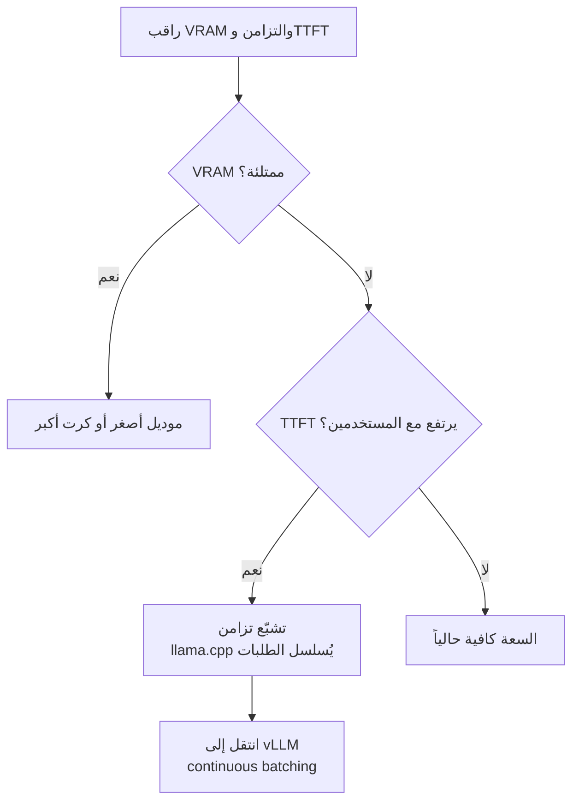

قواعد إبهام للمرحلة 1:
- **1–10 مستخدمين، استخدام متقطّع**: كرت واحد + llama.cpp كافٍ تماماً. لا تُفرط في الهندسة.
- **التزامن الحقيقي يقترب من ثابت**: llama.cpp يعالج الطلبات بشكل شبه متسلسل؛ TTFT قد يتجاوز دقائق تحت ~64 طلباً متزامناً. هذه هي **علامة الانتقال** إلى vLLM على GPU أكبر.
- **خطّط بالقياس لا بالتخمين**: دع رسم بياني واحد لـ TTFT و VRAM يقود القرار.

---

<a id="08-operations-cost"></a>

### 8.6 نموذج التكلفة

> ⚠️ كل الأرقام أدناه **تقديرية وتقريبية** لأغراض المقارنة فقط (يونيو 2026). الأسعار تتغيّر بسرعة وتختلف بالمنطقة والمزوّد ونسبة الاستخدام. استخدمها لاتخاذ قرار الاتجاه، لا للميزانية الدقيقة.

#### أ) المرحلة الحالية (محلي) ≈ 0

التكلفة الهامشية للتشغيل المحلي على اللابتوب الحالي **شبه صفرية**: لا فواتير per-token، فقط الكهرباء والجهاز الموجود أصلاً. هذا أفضل خيار للتطوير و1–10 مستخدمين داخليين.

#### ب) GPU سحابي ($/ساعة، تقديري)

| الكرت | مناسب لـ | $/ساعة (on-demand، تقديري) |
|---|---|---|
| L4 / G6 | موديلات صغيرة-متوسطة، استدلال | ~$0.8–1.0 |
| A10G / G5 | أفضل توازن سعر/أداء للاستدلال | ~$1.0–1.6 |
| A100 (P4d) | موديلات 70B أو تدريب | ~$3–5 |
| 8× H100 (عقدة) | إنتاج ثقيل عالي التزامن | ~$40–64 |

> ⚠️ سعر إيجار الـ GPU الخام هو **30–40% فقط** من التكلفة الحقيقية. أضف DevOps، وهدر الكرت أثناء الخمول (كرت بنسبة استخدام 10% يضخّم تكلفة التوكن ~10×)، وصيانة وتحديث الموديلات → **اضرب ×2.5 إلى ×3** لتقدير التكلفة الفعلية.

#### ج) محلي/سحابي مقابل managed per-token

افتراضات تقريبية لغرض التوضيح: مستخدم نشِط ينتج ~0.5 مليون توكن/شهر، سعر managed مدمج ~$8/مليون توكن، GPU سحابي مخصّص ~$1.2/ساعة (~$875/شهر تشغيل متواصل قبل ضرب التكلفة الحقيقية).

| عدد المستخدمين | توكنات/شهر (تقديري) | managed (per-token) | self-host سحابي (GPU مخصّص) | الأرجح |
|---|---|---|---|---|
| **10** | ~5M | **~$40** | ~$875+ (كرت خامل غالباً) | ✅ managed أو **محلي** |
| **100** | ~50M | ~$400 | ~$875–1,500 | ⚖️ متقارب — يعتمد على الاستخدام |
| **1000** | ~500M | ~$4,000 | عنقود GPU (عدة آلاف) | ✅ self-host يبدأ يتفوّق |

> 💡 نقطة التعادل المذكورة في الأبحاث: self-host يصبح أرخص فقط فوق ~5.6–6.8 مليون توكن/شهر مقابل النماذج المُدارة عالية الجودة، ومع **نسبة استخدام GPU عالية ومستدامة**. تحت ذلك، managed أرخص وأقل جهداً بفارق كبير — ويُقدَّر أنها الخيار الأفضل لنحو 87% من الحالات.

---

<a id="08-operations-build-vs-buy"></a>

### 8.7 اقتصاديات Build vs Buy: متى تميل الكفّة

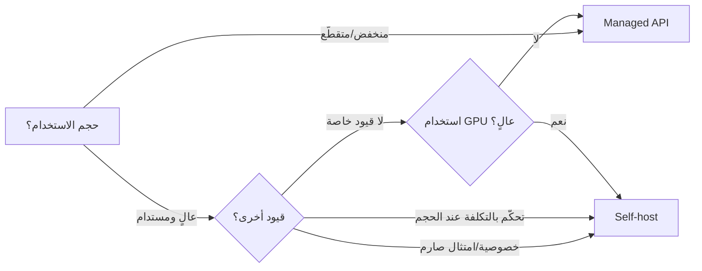

**اشترِ (managed) عندما:**
- الحجم منخفض أو متقطّع (spiky) — لا تدفع ثمن كرت خامل.
- تحتاج جودة نماذج الجبهة (frontier) أو وصولاً سريعاً لأحدث الموديلات.
- لا تريد عبء DevOps والبنية التحتية.

**ابنِ (self-host) عندما:**
- حجم عالٍ **ومستدام** مع نسبة استخدام GPU مرتفعة.
- متطلّبات خصوصية/إقامة بيانات/امتثال صارمة تمنع إرسال البيانات خارجاً.
- استخدام كثيف لموديلات مفتوحة الأوزان أو مضبوطة (fine-tuned).

> ✅ **الميزة المعمارية لمنصّتنا**: بفضل البوّابة الموحّدة، القرار ليس "إمّا/أو" دائم. يمكن المزج: موديل مستضاف محلياً للمهام الحسّاسة/المتكرّرة + موديل managed (Bedrock/Azure OpenAI/Vertex) للمهام الثقيلة أو النادرة — وتبديل النسبة بتغيير الإعداد، لا بإعادة البناء. هذا هو جوهر "نفس الشكل، صناديق أكبر".

> 💡 تحذير من البحث: لا تشترِ GPU مبكراً بلا حدود إنفاق (spend caps). الكفّة لا تميل لـ self-host إلا عند مليارات التوكنات شهرياً للتشغيل المتواصل — وقبلها، البنية المحلية للتطوير + managed للإنتاج هي المسار الأرشد.

---

<a id="08-operations-tooling"></a>

### 8.8 الأدوات المقترحة عملياً

> ⚠️ لا تُركّب كل هذا في اليوم الأول — هذا **تحسين زائد (over-engineering)** لـ 10 مستخدمين. ابدأ بالحدّ الأدنى ثم أضِف عند الحاجة.

**المرحلة 1 (ابدأ هنا — الحدّ الأدنى):**
- ✅ **تسجيل LiteLLM** في PostgreSQL: يعطيك توكنات وتكلفة وإنفاق لكل مفتاح/فريق مجاناً. هذا 80% من المراقبة التي تحتاجها الآن.
- ✅ **`nvidia-smi`** للمراقبة اللحظية للـ GPU.
- ✅ **`docker logs` + `healthcheck`** في compose.
- ✅ **`pg_dump`** يومي عبر cron.

**لاحقاً، عند التوسّع (ليس الآن):**
- 📊 **Prometheus + Grafana**: لوحات تاريخية للمقاييس. LiteLLM يكشف `/metrics` بصيغة Prometheus مباشرةً.
- 📊 **DCGM exporter** (NVIDIA): مقاييس GPU تفصيلية في Prometheus على Kubernetes.
- 📊 **OpenTelemetry** عبر LiteLLM: tracing موزّع عبر الطبقات.
- 📊 **Loki** أو ما يماثله: تجميع سجلّات مركزي عند تعدّد الحاويات.

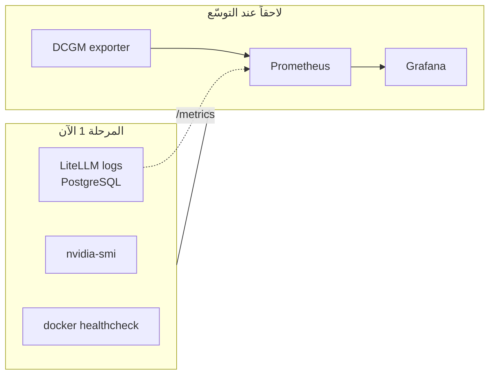

> ✅ **الخلاصة التشغيلية**: في المرحلة 1، تسجيل LiteLLM + `nvidia-smi` + فحوص صحة Docker + نسخة PostgreSQL يومية = تغطية كافية تماماً. كل ما عداه يُضاف **عندما يفرضه النمو فعلاً**، لا قبله. راقب مؤشّرين فقط بانتظام: **VRAM** (حدّ السعة) و**الإنفاق لكل فريق** (حدّ التكلفة) — وستعرف متى يحين وقت الطابق التالي.

<a id="09-future"></a>

## 9. التطوّر المستقبلي والشكل النهائي والمخاطر

بعد اكتمال المراحل الثلاث الأولى (Phase 1–3)، يصبح لدينا "هيكل سكني صالح للسكن": بوّابة LiteLLM في المنتصف، محرّك استدلال خلفها (llama.cpp محلياً أو vLLM سحابياً)، وواجهة Open WebUI للموظفين، كلها في حاويات Docker خلف واجهة OpenAI-compatible موحّدة. هذا القسم يصف ما يأتي بعد ذلك: الطوابق الإضافية التي نبنيها عند الحاجة (لا قبلها)، الشكل النهائي للناطحة المكتملة، ثم سجلّ المخاطر ومؤشّرات النجاح التي تخبرنا أن المبنى "مأهول" فعلاً لا مجرّد واجهة لامعة.

> 💡 المبدأ الحاكم لكل هذا القسم: كل ما يلي **اختياري ومؤجّل**. لا تبنِ طابقاً قبل أن يطلبه ساكن حقيقي. أكبر سبب لفشل مشاريع الـ GenAI ليس جودة الموديل، بل الهندسة المفرطة والقفز إلى التعقيد قبل وجود طلب يبرّره (≈95% من التجارب لا تُحدث أثراً في P&L، و≈30% تُهجَر بعد POC).

<a id="09-future-roadmap"></a>

### 9.1 خارطة التطوّر بعد Phase 3 (مستقبلي)

الجمال في المعمار المتّفق عليه أن كل طابق جديد **يُضاف خلف نفس البوّابة** دون لمس الواجهة أو العملاء (apps/scripts/agents). فيما يلي الطوابق مرتّبة حسب الأولوية العملية المعتادة، وكلها موسومة "لاحقاً، ليس الآن".

| الطابق المستقبلي | متى يُبرَّر (المُحفِّز) | ماذا نضيف عملياً | أثره على البوّابة/العملاء |
|---|---|---|---|
| **RAG (استرجاع معزّز)** | الموظفون يحتاجون إجابات من مستندات الشركة | Open WebUI RAG مع vector DB حقيقي (PGVector/Qdrant/Milvus — **لا** Chroma الافتراضي للإنتاج) + مستخرِج مستندات حقيقي (Tika/Docling) | لا تغيير — RAG يعيش في طبقة الواجهة/التطبيق، والبوّابة تبقى كما هي |
| **توجيه متعدد الموديلات (Routing)** | تعدّد الموديلات (مستضاف + مُدار) وحاجة failover | `model_list` في LiteLLM: مزج موديل محلي + Bedrock/Azure OpenAI/Vertex، مع fallbacks وretries وload balancing | URL/مفتاح واحد للعميل؛ التوجيه شفّاف خلف البوّابة |
| **Fine-tuning / موديلات مخصّصة** | الحاجة لأسلوب/معرفة خاصة لا يحلّها RABG | تدريب LoRA/SFT خارجياً، ثم تقديم الموديل الناتج كـ GGUF (llama.cpp) أو عبر vLLM؛ تسجيله في `model_list` | يظهر كاسم موديل جديد فقط؛ لا تغيير في العقد |
| **Autoscaling** | حمل متغيّر/spiky على GPU سحابي | KEDA لتوسيع الـ pods على عمق الطابور/الطلبات الجارية + Karpenter لتزويد عقد GPU just-in-time وscale-to-zero | يحسّن الكمون والكلفة؛ شفّاف للعميل |
| **High Availability (HA)** | البوّابة أصبحت نقطة فشل واحدة تمنع كل الوصول | عدّة نسخ LiteLLM خلف load balancer + **PostgreSQL** للمفاتيح/الميزانيات + **Redis** لمزامنة الحصص عبر النسخ | بدونها تنحرف الحصص/الميزانيات بين النسخ |
| **Multi-region** | متطلّبات كمون جغرافي أو سيادة بيانات | تكرار نفس الحاويات في أقاليم متعدّدة + توجيه جغرافي؛ External Secrets Operator لتجريد مخزن الأسرار لكل سحابة | نفس الـ manifests؛ الفروق في Terraform vars فقط |

> ⚠️ تحذير ضدّ الهندسة المفرطة: vLLM يحجز ~90% من الـ VRAM وميزته هي throughput تحت تزامن عالٍ — لا تنقل إليه أو تُفعّل autoscaling/MIG لمستخدم واحد أو فريق صغير. القاعدة الفاصلة: **llama.cpp/Ollama كافٍ حتى ~10 مستخدمين؛ الانتقال لـ vLLM + التوسيع يبدأ حين تشارك GPU عبر فريق أو تحتاج كموناً متوقّعاً تحت الحمل.** انظر [القرار المعماري](#06-phases-phase1) كأساس ثابت لا يتغيّر مع كل هذه الإضافات.

> ✅ ملاحظة اقتصادية حاسمة قبل أي شراء GPU: الـ APIs المُدارة أرخص في الأغلبية الساحقة من الحالات (≈87%). نقطة التعادل لتبرير الاستضافة الذاتية تقارب **5.6–6.8 مليون token/شهر** (مقابل Claude Sonnet/GPT-4o) وتصل لـ ≈11 مليار token/شهر للتعادل الحسابي الصرف. وتذكّر أن إيجار الـ GPU الخام ليس سوى 30–40% من الكلفة الحقيقية (المضاعف الفعلي 2.5–3×).

<a id="09-future-final-shape"></a>

### 9.2 الشكل النهائي للنظام بعد اكتمال البناء

الناطحة المكتملة ليست شيئاً مختلفاً عن "البذرة" — هي **نفس الشكل، صناديق أكبر**. الأساس (واجهة OpenAI-compatible) والأعمدة (المبادئ config-driven + الحاويات) لم تتغيّر؛ ما تغيّر هو عدد الطوابق وارتفاعها. الموظف الذي يفتح Open WebUI لا يلاحظ أن المحرّك تحته صار vLLM على عنقود Kubernetes في AWS بدل llama.cpp على لابتوب — لأن المصاعد والسباكة (الشبكة وتدفّق الـ API) لم تتبدّل.

في الحالة النهائية تتوزّع الطبقات هكذا:
- **طبقة الواجهة/UX:** Open WebUI (SSO/OIDC + RBAC + RAG) + تطبيقات داخلية + إضافات IDE — كلها تتكلّم OpenAI API.
- **طبقة البوّابة (لوحة التحكّم):** LiteLLM HA (مفاتيح افتراضية، ميزانيات، حصص token-aware، fallbacks، تسجيل/تدقيق، PII redaction) — نقطة الخروج الوحيدة.
- **طبقة الاستدلال:** vLLM على Kubernetes (GPU Operator، KEDA، Karpenter) + موديلات مُدارة (Bedrock/Azure OpenAI/Vertex) مزيجاً.
- **طبقة الموديلات:** موديلات OSS مستضافة (Gemma/Qwen، ومخصّصة fine-tuned) + موديلات الطرف الثالث عبر API.

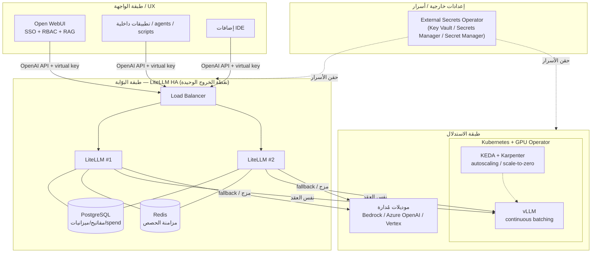

> 💡 الاختبار الحاسم للنجاح المعماري: عند الانتقال من vLLM إلى موديل مُدار، أو من إقليم لآخر، يجب أن يكون التغيير **سطراً في إعداد البوّابة أو متغيّر Terraform** — لا إعادة بناء ولا تعديل في كود العملاء. إن لزِم تعديل العملاء، فقد كُسر العمود الأساسي.

<a id="09-future-risks"></a>

### 9.3 جدول المخاطر والتخفيف

| الفئة | المخاطرة | الأثر | التخفيف |
|---|---|---|---|
| **تقني** | تشغيل llama.cpp/Ollama كخادم متعدّد المستخدمين تحت حمل | انهيار throughput وTTFT > 3 دقائق عند ~64 مستخدماً متزامناً (طلبات مُسلسَلة) | الانتقال لـ vLLM (continuous batching) عند مشاركة GPU عبر فريق؛ لا تتجاوز الحدّ الفاصل |
| **تقني** | افتراض أن كل خوادم OpenAI-compatible متطابقة | كسر صامت في tool-calling/structured output/vision/logprobs عند تبديل المحرّك | اختبار الـ endpoints المحدّدة التي يعتمدها العميل **قبل** أي تبديل |
| **تقني** | انهيار vLLM tensor-parallel على `/dev/shm` صغير، أو قتل الـ pod أثناء تحميل الموديل | crash loops وعدم استقرار النشر | `ipc: host`/`shm_size` كبير + `startupProbe` طويل بـ failureThreshold عالٍ + `terminationGracePeriodSeconds` ≥ 300 مع preStop drain |
| **تشغيلي** | البوّابة نقطة فشل واحدة تمنع كل الوصول لـ LLM | توقّف كامل لخدمة الذكاء | LiteLLM HA متعدّد النسخ خلف LB + PostgreSQL + Redis؛ مراقبة وتنبيهات |
| **تشغيلي** | "Pilot purgatory" — معايير نجاح ضعيفة وغياب حلقة تغذية راجعة | المشروع عالق في POC ولا يصل للإنتاج (≈⅔ من المؤسّسات) | تعريف KPIs قابلة للقياس قبل الإطلاق ([9.4](#09-future-kpis)) + حلقة feedback بعد الإطلاق |
| **تشغيلي** | الالتفاف على البوّابة (تطبيقات تنادي المزوّدين مباشرة) | فقدان تتبّع الإنفاق والميزانيات والتدقيق | فرض أن **كل** الحركة تمرّ بمفاتيح LiteLLM الافتراضية؛ منع المفاتيح الخام |
| **تكلفة** | شراء GPU مبكّراً بلا spend caps، أو GPU بـ 10% استغلال | تضخّم الكلفة/token ~10×؛ كلفة فعلية 2.5–3× الإيجار الخام | البقاء على API مُدار حتى تجاوز نقطة التعادل (~5.6–6.8M token/شهر)؛ reserved/spot pricing؛ scale-to-zero |
| **تكلفة** | افتراض أن الموديلات المفتوحة/المحلية "مجانية" | كلفة DevOps وidle-GPU ومُحدّثات الموديل غير محسوبة | حساب الكلفة الحقيقية بالمضاعف 2.5–3×؛ تتبّع الإنفاق بالـ tags في LiteLLM |
| **أمان** | تعريض منفذ البوّابة للإنترنت (CVE سابقة: SQLi/RCE قبل المصادقة) | اختراق كامل | **عدم** تعريض منفذ LiteLLM أبداً؛ خلف الشبكة الداخلية فقط؛ ترقيع سريع للنسخة المستقرّة |
| **أمان** | trusted-header auth في Open WebUI قابل للانتحال | انتحال هوية أي مستخدم | خلف بروكسي مُصادِق مغلق فقط (oauth2-proxy/Authentik/Cloudflare Access)؛ تفضيل OIDC |
| **أمان** | تسجيل المحتوى الكامل = بحيرة بيانات PII | تسريب/مخاطر امتثال | تسجيل metadata فقط + PII redaction + تدقيق بالهوية؛ LITELLM_SALT_KEY لتشفير الاعتمادات |
| **أمان** | اعتبار فلترة المحتوى دفاعاً كاملاً | تجاوزها عبر prompt-injection/leakage | دفاعات على جانب الموديل + إشراف بشري؛ لا تكتفِ بحارس البوّابة |

<a id="09-future-kpis"></a>

### 9.4 مؤشّرات النجاح (KPIs) القابلة للقياس

النجاح لا يُقاس بـ "هل يعمل الموديل؟" بل بمؤشّرات تشغيلية واعتمادية وأمنية ملموسة. عرّفها **قبل** الإطلاق وراقبها (Prometheus + Grafana + DCGM exporter لاحقاً).

- **الأداء/الكمون:**
  - [ ] TTFT (time-to-first-token) ضمن هدف محدّد (مثلاً p95 < 2s للتفاعلي) وثابت تحت الحمل.
  - [ ] Tokens/sec الإجمالي يتوسّع مع التزامن (دليل أن continuous batching يعمل) لا ينهار.

- **الاعتمادية:**
  - [ ] Uptime للبوّابة ≥ هدف SLA (مثلاً 99.9%) — لا نقطة فشل واحدة فعّالة.
  - [ ] نجاح آلية fallback: نسبة الطلبات التي نجت من فشل المزوّد الأساسي عبر التوجيه التلقائي.

- **الحوكمة/التكلفة:**
  - [ ] 100% من الحركة تمرّ بالبوّابة (صفر استدعاءات مباشرة بمفاتيح خام).
  - [ ] الإنفاق منسوب بالكامل (per-user/team/app عبر virtual keys + tags) وضمن الميزانيات المحدّدة.
  - [ ] الكلفة/token الفعلية محسوبة بالمضاعف الحقيقي (2.5–3×) ومقارنة دورياً بالـ API المُدار لتأكيد جدوى الاستضافة.

- **الأمان/الامتثال:**
  - [ ] منفذ البوّابة غير مكشوف للإنترنت (تحقّق دوري).
  - [ ] جميع المستخدمين عبر SSO/OIDC مع RBAC؛ صفر مفاتيح خام مشتركة.
  - [ ] سجلّات تدقيق بالهوية فعّالة مع PII redaction؛ زمن الترقيع (patch lag) للنسخ ضمن الهدف.

- **التبنّي والأثر (الأهم — يمنع pilot purgatory):**
  - [ ] مستخدمون نشطون (DAU/WAU) واتّجاه تصاعدي، لا مجرّد تسجيلات.
  - [ ] أثر قابل للقياس على عملية عمل حقيقية (وقت موفّر/مهام منجزة) — معيار النجاح المعرّف مسبقاً.

> ✅ المعيار الذهبي للناطحة المكتملة: المبنى ليس "مبنياً" بل **"مأهولاً"** — مستخدمون حقيقيون، إنفاق محكوم ومنسوب، وصفر استدعاءات تلتفّ على البوّابة. عندها فقط ننتقل من "البناء" إلى "الصيانة بعد السكن" (المراقبة والتحسين المستمر).

<a id="10-appendix"></a>

## 10. الملاحق والمراجع

هذا القسم هو "غرفة المعدّات" في ناطحة السحاب: لا يضيف طوابق جديدة، لكنه يجمع المخططات المرجعية، ومفاتيح التشغيل، وقوائم التسليم في مكان واحد يسهل الرجوع إليه. كل ما يلي مرجعيّ وعملي — والأمثلة هنا **هياكل إشارية (skeletons) للفهم لا للنسخ الحرفي إلى الإنتاج**.

> ⚠️ كل مقاطع الإعداد أدناه تستخدم placeholders (مثل `sk-xxx`، `CHANGE_ME`). لا تضع مفاتيح حقيقية في ملفات تُرفَع لمستودع، ولا تنسخ هذه الهياكل كما هي دون مراجعة المتغيّرات والإصدارات.

<a id="10-appendix-glossary"></a>

### 10.1 قاموس المصطلحات (عربي/إنجليزي)

| المصطلح (EN) | المقابل/الشرح بالعربية | الدور في معماريتنا |
|---|---|---|
| **OpenAI-compatible API** | واجهة برمجية متوافقة مع معيار OpenAI (`/v1/chat/completions`, `/v1/models`...) | "عقد النقل" (portability contract): الأساس والأعمدة التي تبقى ثابتة مهما تبدّل المحرّك |
| **Inference Engine** | محرّك الاستدلال (تشغيل الموديل وإنتاج المخرجات) | الطابق السفلي: `llama.cpp` الآن، `vLLM` في السحابة لاحقاً |
| **llama.cpp / llama-cpp-python** | محرّك خفيف لتشغيل موديلات GGUF؛ يوفّر خادم `python -m llama_cpp.server` | محرّكنا المحلي على RTX 4050 (6GB VRAM) |
| **vLLM** | نظام خدمة عالي الإنتاجية (continuous batching, PagedAttention) | محرّك السحابة المستقبلي تحت **نفس** الواجهة |
| **GGUF** | صيغة ملفات موديلات مكمّمة (quantized) خفيفة الذاكرة | الصيغة التي نشغّلها محلياً |
| **Quantization** | التكميم: ضغط أوزان الموديل لتقليل استهلاك الذاكرة | يتيح موديلات أكبر على كرت 6GB |
| **LiteLLM Proxy** | بوّابة LLM موحّدة (مفاتيح/توجيه/حصص/تسجيل) متوافقة مع OpenAI | البوّابة المركزية (control plane) — نقطة الخروج الوحيدة |
| **Virtual Key** | مفتاح افتراضي يُصدَر لكل مستخدم/فريق بميزانية وحدود خاصة | بديل آمن عن مفاتيح المزوّد الخام |
| **Open WebUI** | واجهة محادثة للموظفين (RBAC/SSO + RAG مدمج) | الطابق العلوي: واجهة المستخدم |
| **Gateway / Control Plane** | البوّابة / مستوى التحكّم | الطبقة التي تفصل العملاء عن المزوّدين |
| **RBAC** | التحكّم بالوصول حسب الأدوار | صلاحيات المستخدمين في Open WebUI |
| **SSO / OIDC** | الدخول الموحّد / بروتوكول الهوية | ربط هوية الشركة لاحقاً |
| **RAG** | التوليد المعزّز بالاسترجاع (استرجاع مستندات قبل الإجابة) | ميزة Open WebUI، مرحلة لاحقة |
| **Continuous Batching** | تجميع الطلبات المستمر (ميزة vLLM للتوسّع تحت الحِمل) | سبب اختيار vLLM للسحابة لا للابتوب |
| **Docker Compose** | أداة تشغيل عدّة حاويات معاً عبر ملف واحد | منسّق المرحلة الأولى |

<a id="10-appendix-compose"></a>

### 10.2 مثال إشاري: هيكل `docker-compose.yml` (الخدمات الثلاث)

> 💡 الفكرة المعمارية: ثلاث خدمات في شبكة Docker داخلية واحدة. **العميل يرى البوّابة فقط**؛ المحرّك لا يُكشَف خارجياً.
>
> ⚠️ **أسماء توضيحية فقط:** المقاطع أدناه تستخدم `engine/gateway/webui/db` للتوضيح. **الأسماء المعتمدة (R-ARCH-31) = `llamacpp` · `litellm` · `open-webui` · `postgres`** (والمحرّك على المنفذ **8080** لا 8000). مصدر الحقيقة = [compose/docker-compose.yml](compose/docker-compose.yml) (**4 خدمات** بعد [ADR-025](docs/DECISIONS.md)).

```yaml
# مثال إشاري — للفهم لا للنسخ الحرفي
services:

  # 1) المحرّك (llama.cpp الآن — يُستبدل بـ vLLM لاحقاً دون تغيير العقد)
  engine:
    image: <llama-cpp-python-server-image>   # placeholder
    # نقطة النهاية الداخلية فقط: http://engine:8000/v1
    expose: ["8000"]                          # لا ports: لا كشف خارجي
    # على ويندوز: GPU عبر WSL2 backend
    deploy:
      resources:
        reservations:
          devices:
            - { driver: nvidia, count: all, capabilities: [gpu] }
    volumes:
      - ./models:/models:ro                   # ملفات GGUF
    # command: --model /models/<model>.gguf --n_gpu_layers -1 --host 0.0.0.0

  # 2) البوّابة (نقطة الخروج الوحيدة المتوافقة مع OpenAI)
  gateway:                                     # LiteLLM Proxy
    image: <litellm-proxy-image>              # placeholder
    depends_on: [engine, db]
    ports: ["4000:4000"]                       # تُكشف داخلياً للشبكة الموثوقة فقط
    environment:
      - LITELLM_MASTER_KEY=${LITELLM_MASTER_KEY}
      - LITELLM_SALT_KEY=${LITELLM_SALT_KEY}
      - DATABASE_URL=${DATABASE_URL}
    volumes:
      - ./litellm-config.yaml:/app/config.yaml:ro

  # 3) الواجهة (Open WebUI — تتحدث مع البوّابة كأنها OpenAI)
  webui:
    image: <open-webui-image>                 # placeholder
    depends_on: [gateway]
    ports: ["3000:8080"]
    environment:
      - OPENAI_API_BASE_URL=http://gateway:4000/v1
      - OPENAI_API_KEY=${WEBUI_VIRTUAL_KEY}    # مفتاح افتراضي من البوّابة
      - WEBUI_SECRET_KEY=${WEBUI_SECRET_KEY}

  # دعم البوّابة: PostgreSQL لازم للمفاتيح/الميزانيات/الإنفاق
  db:
    image: postgres:16                         # placeholder للإصدار
    environment:
      - POSTGRES_PASSWORD=CHANGE_ME
    volumes:
      - pgdata:/var/lib/postgresql/data

volumes:
  pgdata:
```

> ⚠️ ملاحظة GPU على ويندوز: التمرير يعمل عبر **WSL2 backend فقط**، وداخل WSL2 ثبّت `cuda-toolkit-12-x` حصراً — **لا** تثبّت أي تعريف NVIDIA لينكس وإلا تعطّل التمرير. (التفاصيل في [القسم 3](#03-decisions) وسجلّ القرارات المعتمد [docs/DECISIONS.md](docs/DECISIONS.md).)

<a id="10-appendix-litellm"></a>

### 10.3 مثال إشاري: هيكل إعداد LiteLLM (`model_list` يشير للمحرّك)

> 💡 جوهر "نفس الشكل، صناديق أكبر": `model_list` يربط اسماً منطقياً (يراه المستخدم) بـ `api_base` للمحرّك. **التبديل للسحابة = تغيير سطر `api_base` واحد.**
>
> ℹ️ *(مثال إيضاحي/تاريخي — الإعداد المعتمد في [config/litellm/litellm-config.yaml](config/litellm/litellm-config.yaml): الموديل الحالي `Gemma 4` عبر `api_base: http://llamacpp:8080/v1`.)*

```yaml
# مثال إشاري — litellm-config.yaml (المعتمد: Gemma 4 على http://llamacpp:8080/v1)
model_list:
  # الموديل المحلي عبر llama.cpp اليوم
  - model_name: Gemma 4                        # الاسم الذي يراه العميل/الواجهة
    litellm_params:
      model: openai/<gguf-model-id>            # بادئة openai/ = واجهة متوافقة
      api_base: http://llamacpp:8080/v1        # ← غيّر هذا فقط للانتقال لـ vLLM/السحابة
      api_key: "dummy"                          # المحرّك المحلي لا يتحقق

  # لاحقاً، ليس الآن: مزج موديل مُدار خلف نفس البوّابة
  # - model_name: cloud-managed
  #   litellm_params:
  #     model: bedrock/<model-id>              # أو azure/... أو vertex_ai/...

litellm_settings:
  # سقف أعلى للمفاتيح المُصدَرة ذاتياً (حوكمة)
  upperbound_key_generate_params:
    max_budget: 50
    budget_duration: "30d"

general_settings:
  master_key: ${LITELLM_MASTER_KEY}            # لا تضعه نصاً صريحاً
```

إصدار مفتاح افتراضي لمستخدم (مرجع API):

```http
POST /key/generate
Authorization: Bearer <LITELLM_MASTER_KEY>
{ "models": ["Gemma 4"], "max_budget": 5,
  "budget_duration": "30d", "rpm_limit": 60, "user_id": "alice" }
```

<a id="10-appendix-env"></a>

### 10.4 أهم متغيّرات البيئة (`.env`)

> ⚠️ ملف `.env` يجب أن يكون خارج Git (`.gitignore`). كل القيم أدناه placeholders.
>
> ℹ️ *(مثال إيضاحي/تاريخي — أسماء المتغيّرات المعتمدة في [config/env/.env.example](config/env/.env.example): مفتاح الواجهة الفعلي هو `OPENWEBUI_LITELLM_KEY` (لا `WEBUI_VIRTUAL_KEY`)، والواجهة تشير إلى `http://litellm:4000/v1` لا `gateway`.)*

| المتغيّر | الخدمة | الغرض |
|---|---|---|
| `LITELLM_MASTER_KEY` | البوّابة | المفتاح الرئيسي (صيغة `sk-...`) — يُنشئ/يدير المفاتيح |
| `LITELLM_SALT_KEY` | البوّابة | تشفير بيانات اعتماد المزوّدين المخزّنة |
| `DATABASE_URL` | البوّابة + DB | اتصال PostgreSQL (لازم للمفاتيح/الميزانيات/الإنفاق) |
| `OPENWEBUI_LITELLM_KEY` | الواجهة | مفتاح افتراضي صادر من البوّابة (وليس مفتاح مزوّد خام) |
| `WEBUI_SECRET_KEY` | الواجهة | توقيع الجلسات — ثابت عبر إعادات التشغيل |
| `OPENAI_API_BASE_URL` | الواجهة | يشير إلى `http://litellm:4000/v1` |
| `POSTGRES_PASSWORD` | DB | كلمة مرور قاعدة البيانات |

> 💡 لاحقاً، ليس الآن: عند تعدّد نسخ البوّابة (HA) أضِف `REDIS_URL` لمزامنة الحصص/الميزانيات بدقّة عبر النسخ.

<a id="10-appendix-quickstart"></a>

### 10.5 قائمة تحقّق "Quick Start" للمرحلة الأولى (Phase 1)

ابدأ بسيطاً واعمل أولاً، ثم صلّب لاحقاً. المرحلة الأولى = أساس + ثلاثة طوابق فقط.

> ℹ️ *(قائمة إيضاحية — خطوات التشغيل المعتمدة والمحدّثة في [docs/RUNBOOK.md](docs/RUNBOOK.md): المحرّك الحالي صورة llama.cpp تخدم Gemma 4 على المنفذ 8080، والبوّابة على `http://llamacpp:8080/v1`.)*

- [ ] التحقق من تمرير GPU: تشغيل حاوية اختبار CUDA عبر `--gpus=all` ونجاح `nvidia-smi` داخلها (WSL2 backend).
- [ ] تجهيز ملف موديل GGUF واحد في مجلد الموديلات (`MODEL_DIR`).
- [ ] تشغيل خدمة **المحرّك** (`llamacpp`) والتأكد أنها تستجيب على `/v1/models` داخلياً.
- [ ] إعداد `litellm-config.yaml`: `model_list` واحد يشير إلى `http://llamacpp:8080/v1`.
- [ ] ضبط `.env` (Master Key، Salt Key، DATABASE_URL، كلمات المرور) — قيم قوية، خارج Git.
- [ ] تشغيل **PostgreSQL** + **البوّابة**، والتأكد من ظهور الموديل عبر `GET /v1/models` على البوّابة.
- [ ] إصدار **مفتاح افتراضي** واحد للواجهة عبر `POST /key/generate`.
- [ ] تشغيل **Open WebUI** موجّهةً للبوّابة؛ أول مستخدم يسجّل = admin.
- [ ] اختبار محادثة من الواجهة → تظهر في سجلّ الإنفاق على البوّابة.
- [ ] تأكيد أمني: **منفذ المحرّك غير مكشوف خارجياً**، والبوّابة خلف شبكة موثوقة فقط.
- [ ] اختبار التبديل النظري: تغيير `api_base` وحده يكفي لتوجيه نفس الاسم لمحرّك آخر (دون لمس الواجهة).

<a id="10-appendix-decisions-index"></a>

### 10.6 فهرس سجل القرارات (ADR) — روابط إلى القسم 3

> سجلّ القرارات المعتمد والمُرقَّم رسمياً = [docs/DECISIONS.md](docs/DECISIONS.md) (ADR-001..025) — هو المرجع الوحيد لكل قرار معماري وحالته. (الملخّص المبكّر داخل هذه الوثيقة في [القسم 3.2](#03-decisions-adr-log) و[رحلة القرار](#03-decisions-journey).)

<a id="10-appendix-references"></a>

### 10.7 روابط مراجع مفيدة

**عقد الواجهة والبوّابة (LiteLLM):**
- توثيق LiteLLM Proxy العام — https://docs.litellm.ai/docs/simple_proxy
- المفاتيح الافتراضية (Virtual Keys) — https://docs.litellm.ai/docs/proxy/virtual_keys
- المستخدمون والفِرق والميزانيات — https://docs.litellm.ai/docs/proxy/users
- مستودع LiteLLM — https://github.com/BerriAI/litellm

**الواجهة (Open WebUI):**
- الدخول الموحّد (SSO/OIDC) — https://docs.openwebui.com/features/authentication-access/auth/sso/
- التحكّم بالوصول (RBAC) — https://docs.openwebui.com/features/authentication-access/rbac/
- الميزات العامة — https://docs.openwebui.com/features/

**المحرّكات (المحلي → السحابة):**
- llama.cpp vs vLLM (اختيار المحرّك) — https://developers.redhat.com/articles/2026/06/15/llamacpp-vs-vllm-choosing-right-local-llm-inference-engine
- نشر vLLM عبر Docker — https://inference.net/content/vllm-docker-deployment/
- دليل vLLM للإنتاج 2026 — https://www.sitepoint.com/vllm-production-deployment-guide-2026/
- llama-swap (تبديل موديلات خلف واجهة موحّدة) — https://github.com/mostlygeek/llama-swap

**GPU على ويندوز/WSL2 وDocker:**
- دليل NVIDIA لـ CUDA على WSL — https://docs.nvidia.com/cuda/wsl-user-guide/index.html
- دعم GPU في Docker Desktop — https://docs.docker.com/desktop/features/gpu/

**المعمارية المرجعية والاقتصاد (سحابة لاحقاً):**
- معمارية بوّابة GenAI متعدّدة المزوّدين (AWS) — https://aws.amazon.com/blogs/machine-learning/streamline-ai-operations-with-the-multi-provider-generative-ai-gateway-reference-architecture/
- بوّابة Open WebUI + LiteLLM (دليل عملي) — https://dev.to/khalifornia/how-to-build-a-self-hosted-ai-gateway-with-litellm-and-open-webui-fn3
- اقتصاديات الاستضافة الذاتية مقابل APIs المُدارة — https://www.sitepoint.com/self-hosted-llm-costs-2026/

> ✅ خلاصة الملحق: ابدأ بالهياكل الثلاثة أعلاه، حقّق Quick Start، وأبقِ كل شيء config-driven. عند التوسّع، لا تُعيد البناء — تكبر الصناديق فقط، ويبقى العقد (OpenAI-compatible) ثابتاً.
